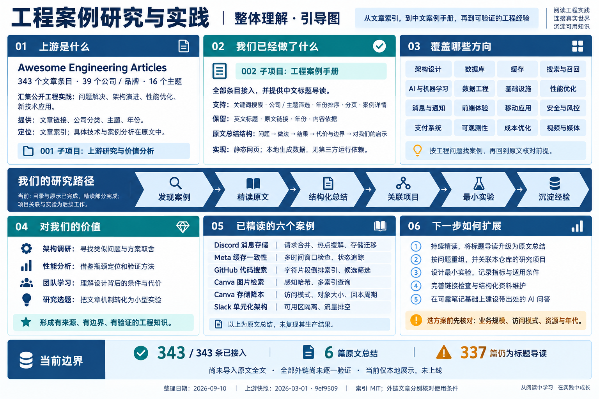
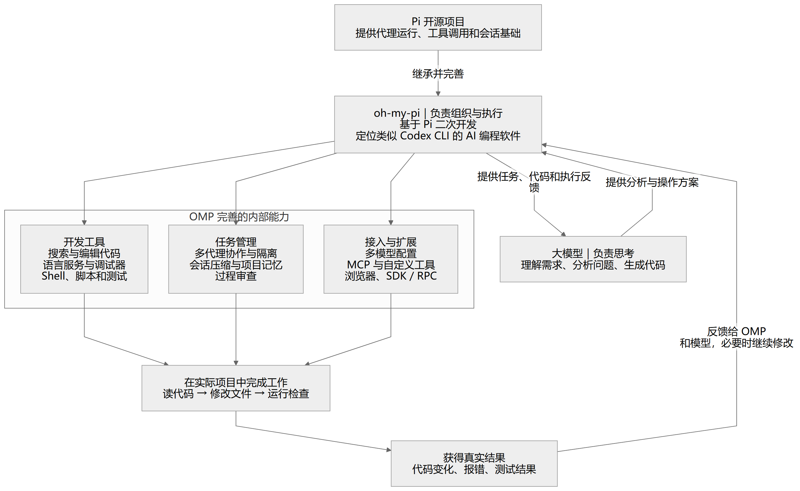
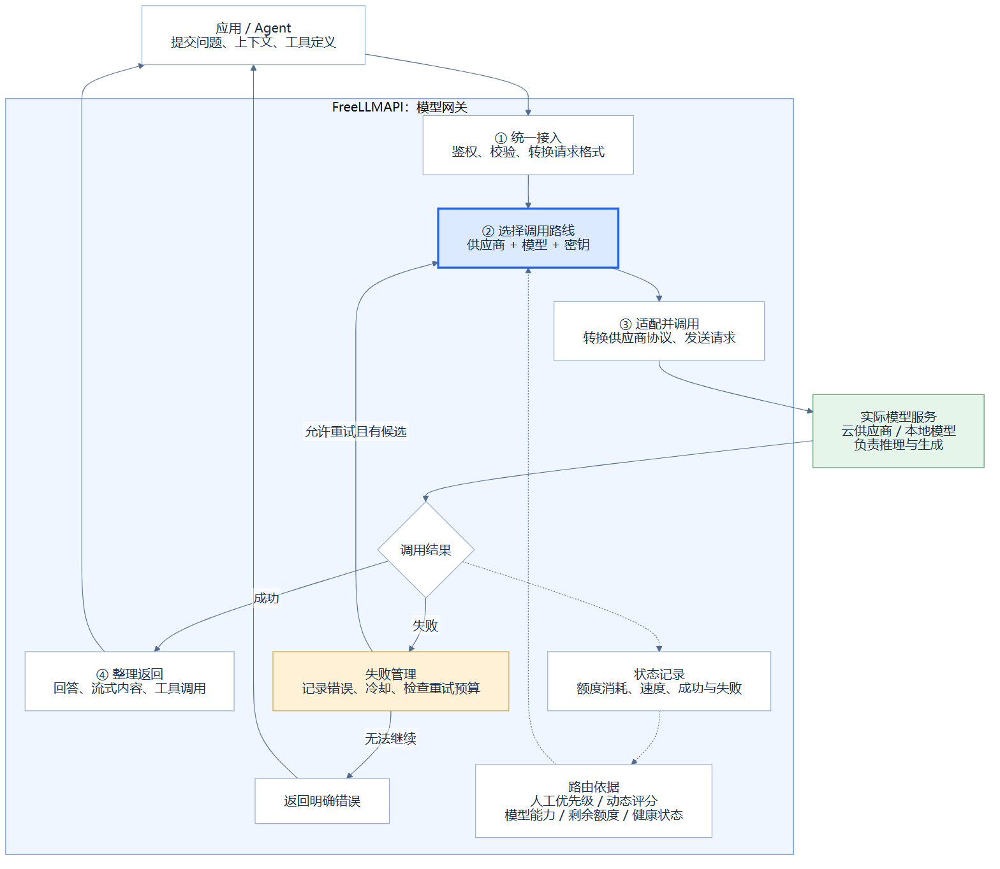
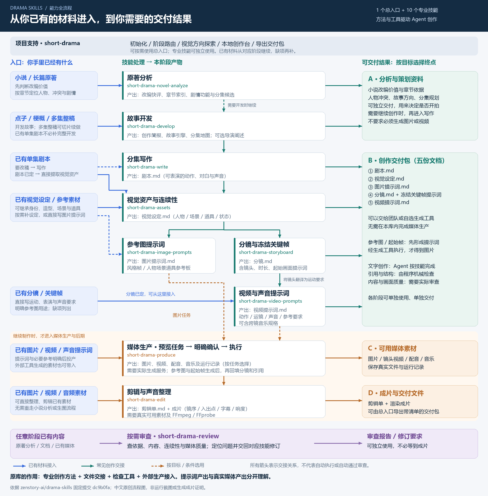

# GitHub 项目研究集

持续收录值得研究的 GitHub 项目，以**原库的核心能力**为主线，说明它能做什么、如何工作、适用于什么场景，再关联我们的研究笔记和实践演示。

这里是研究总入口：先通过有序索引了解项目，再进入子目录查看研究笔记、界面截图和 Web 演示。

**当前进度：** 按原库统计，已收录 **7** 个研究项目。Awesome Engineering Articles 提供工程文章的收集、分类与导航，其配套案例手册提供 343 条中文导读与 6 篇原文总结；LongHorizon-Harness 聚焦复杂目标拆解与 Agent 持续执行；oh-my-pi 是基于 Pi 二次开发、类似 Codex CLI 的 AI 编程 Agent 工具，依靠接入模型并完善工具与执行流程。案例手册与 LongHorizon 研究存档已发布到 GitHub Pages；OMP 当前为文档研究，运行待复现、未部署演示。XXG 通过光源与阴影描述指导图像大模型结合原图生成编辑结果；本地已完成三次人像布光及商品布光实验，提供实际效果、逐字提示词和偏差观察，已发布并验证展示。

FreeLLMAPI 是一个自托管模型网关，对外统一模型接口，对内负责选路、适配、额度与失败管理。研究索引 005，历史目录 `008-freellmapi/`；已整理共同架构、七个产品对比与开发取舍，网页已部署并验证，上游网关运行待复现。

XXD Panel 028 以审美提示词和交付流程指导图像模型，将照片转译为二维微缩插画；本地以六张微缩扩展效果展示多图组合与定制，并整理能力边界和待验证产品价值，已部署并验证。

[打开在线总入口](https://yydshly.github.io/0911_codex_project/) · [工程案例手册](https://yydshly.github.io/0911_codex_project/002-engineering-casebook/) · [LongHorizon-Harness 存档](https://yydshly.github.io/0911_codex_project/003-longhorizon-harness/)

Drama Skills 支持从小说或一句话点子生成短剧：开发故事、编写分集剧本、确定视觉设定、设计分镜与生成提示词；接入外部模型后生产图片、视频、配音和音乐，再剪辑成片，并支持任意阶段审查。 本地新增完整流程引导、技能对照与两种入口的实际案例；视频暂不执行，中文网页已部署并验证。

## 项目索引

按原库去重、按研究索引升序排列：001 为工程文章库，002 为 LongHorizon-Harness，003 为 oh-my-pi，004 为 XXG Portrait Rebuild Light。案例手册归属 001，不单独计数。研究索引与历史存储路径分开：保留已发布的 `002-engineering-casebook/` 和 `003-longhorizon-harness/`，旧链接继续有效；003 的资料存于 `004-oh-my-pi/`，004 存于 `005-xxg-portrait-rebuild-light/`。

| 编号 | 项目 / 研究入口 | 原库 | 核心能力摘要 | 研究状态 | 演示 / 关联 |
| :--- | :--- | :--- | :--- | :--- | :--- |
| 001 | [Awesome Engineering Articles](projects/001-awesome-engineering-articles/README.md) | [ashishps1/awesome-engineering-articles](https://github.com/ashishps1/awesome-engineering-articles) | 按公司、技术主题和年份汇集 343 篇工程实践文章，帮助快速发现相关案例、定位原始资料，为架构调研、技术学习和实验选题提供入口。 | 研究中（初步分析完成） | [配套在线手册](https://yydshly.github.io/0911_codex_project/002-engineering-casebook/) |
| 002 | [LongHorizon-Harness](projects/003-longhorizon-harness/README.md) | [AMAP-ML/LongHorizon-Harness](https://github.com/AMAP-ML/LongHorizon-Harness) | 动态拆解复杂目标，指导现有 Agent 按计划分轮执行，以独立验收、可信进度和失败反馈持续修正计划，支持任务续接及无需持续盯守的推进。 | 文档与源码已整理，上游运行待复现 | [在线研究存档](https://yydshly.github.io/0911_codex_project/003-longhorizon-harness/) |
| 003 | [oh-my-pi（OMP）](projects/004-oh-my-pi/README.md) | [can1357/oh-my-pi](https://github.com/can1357/oh-my-pi) | 基于 Pi 二次开发、类似 Codex CLI 的 AI 编程 Agent 工具；依靠接入的大模型，完善代码编辑、语言服务、调试和多代理协作，执行代码分析、修改、检查与反馈流程。 | 理解与模块研究已整理，上游运行待复现 | [研究笔记](projects/004-oh-my-pi/notes.md)；演示未部署 |
| 004 | [XXG Portrait Rebuild Light](projects/005-xxg-portrait-rebuild-light/README.md) | [moskoo/xxg-portrait-rebuild-light](https://github.com/moskoo/xxg-portrait-rebuild-light) | 将光源方向、大小、软硬、颜色与投射阴影写成提示词，连同原图和人物／构图保留要求交给宿主图像大模型，生成重新布光、曝光与肤质编辑结果，再对照验收。原库提供摄影规则和流程，成像能力来自模型。 | 三次布光与商品扩展已运行，完整技能与系统评测待复现 | [中文能力展示说明](projects/005-xxg-portrait-rebuild-light/README.md#我们新增的展示)；[在线效果展示](https://yydshly.github.io/0911_codex_project/005-xxg-portrait-rebuild-light/) |
| 005 | [FreeLLMAPI](projects/008-freellmapi/README.md) | [tashfeenahmed/freellmapi](https://github.com/tashfeenahmed/freellmapi) | 自托管模型网关：对外统一模型接口，对内选择供应商、模型与密钥路线，适配接口差异并管理额度、冷却和失败回退；应用 / Agent 负责组织任务，实际模型负责推理。 | 能力、架构与同类对比已整理；上游运行待复现 | [在线模型网关理解](https://yydshly.github.io/0911_codex_project/008-freellmapi/) · [产品对比](projects/008-freellmapi/comparison.md)；已部署并验证 |
| 008 | [Drama Skills](projects/006-drama-skills/README.md) | [zenstory-ai/drama-skills](https://github.com/zenstory-ai/drama-skills) | 支持从小说或一句话点子生成短剧：开发故事、编写分集剧本、确定视觉设定、设计分镜与生成提示词；接入外部模型后生产图片、视频、配音和音乐，再剪辑成片，并支持任意阶段审查。 | 两种入口已有实际文档，点子案例获得六格图；视频未执行，网页已部署并验证 | [在线流程与案例展示](https://yydshly.github.io/0911_codex_project/006-drama-skills/) · [案例与证据](projects/006-drama-skills/demos/README.md) |
| 009 | [XXD Panel 028](projects/007-xxd-panel-028/README.md) | [nevertoday/xxd-panel-028](https://github.com/nevertoday/xxd-panel-028) | 用微缩审美与交付规范指导图像模型，将照片转译为二维微缩插画；支持四模式、比例、文字与批量验收，不输出三维模型。 | 七场景已实测；六张微缩扩展与能力、价值边界已整理 | [理解与价值](projects/007-xxd-panel-028/understanding.md) · [扩展效果](projects/007-xxd-panel-028/extensions/miniature-scenes/README.md) · [在线效果展示](https://yydshly.github.io/0911_codex_project/007-xxd-panel-028/)；已部署并验证 |

Drama Skills 的研究索引保留本次登记的 008，资料存于历史目录 `006-drama-skills/`；其余已登记研究由各自任务提交，编号不复用。

## 项目预览

### 001 · Awesome Engineering Articles

**原库能力：工程案例收集、分类与导航。** 研究版本收录 39 个公司／品牌的 343 个文章条目，标注主题、年份并链接原文，降低寻找工程经验的成本。复杂系统的实现位于原文中，上游本身是轻量的 Markdown 索引。

暂无截图。原库是文章索引，可通过配套在线手册浏览其案例；在线手册是本地新增的展示能力。

[查看研究](projects/001-awesome-engineering-articles/README.md) · [上游仓库](https://github.com/ashishps1/awesome-engineering-articles) · [配套在线手册](https://yydshly.github.io/0911_codex_project/002-engineering-casebook/)

#### 配套案例手册（保留历史目录 002）

**配套能力：中文案例检索与结构化阅读。** 基于原库的资料组织能力，补充搜索、组合筛选、排序和详情展示。已接入全部条目，其中 6 篇记录问题、做法、结果、代价和研究启示，其余 337 篇仍为标题导读。

暂无真实截图；展示页已通过数据与逻辑检查，并已验证 GitHub Pages 页面及主要资源与发布提交一致。



上图为 AI 生成的整体说明图，非软件截图；记录 2026-09-10 部署前的理解快照。图中部署状态是历史记录，当前状态以索引和项目说明为准。

[在线展示](https://yydshly.github.io/0911_codex_project/002-engineering-casebook/) · [配套手册说明](projects/002-engineering-casebook/README.md) · [阅读中文案例目录](projects/002-engineering-casebook/cases.md) · [原库](https://github.com/ashishps1/awesome-engineering-articles)

### 002 · LongHorizon-Harness

**原库能力：复杂目标拆解、分轮执行与独立验收。** 管理者依据已验证进度安排任务，执行者调用现有 Agent 操作，审计者检查真实结果并反馈下一轮；在条件充分时无需人持续盯守，但不保证任意目标都成功。


原创指导图，非上游界面或运行截图。研究固定 v0.1.7；完整覆盖与 Codex、Claude Code、OpenClaw、Hermes 和 MetaGPT 的比较，区分源码事实、作者报告与待验证事项。

[完整研究](projects/003-longhorizon-harness/research.md) · [在线研究存档](https://yydshly.github.io/0911_codex_project/003-longhorizon-harness/) · [可编辑指导图](projects/003-longhorizon-harness/assets/guide.svg)

### 003 · oh-my-pi（OMP）

**原库能力：基于 Pi 二次开发、类似 Codex CLI 的 AI 编程 Agent 工具。** 大模型负责理解、分析和生成，OMP 完善工具、执行流程与协作，把任务落到实际项目的读代码、改文件、运行检查和结果反馈中；它本身没有训练一个新模型。



沿用讨论确认的模块流程图，为原创理解示意图，非上游界面或运行截图。固定研究提交 `d884057`；已整理概念、文档与部分核心源码，未安装实测、未部署演示。

[查看研究](projects/004-oh-my-pi/README.md) · [内部模块与研究重点](projects/004-oh-my-pi/notes.md) · [上游仓库](https://github.com/can1357/oh-my-pi) · [矢量图](projects/004-oh-my-pi/assets/guide.svg) · [Mermaid 源文件](projects/004-oh-my-pi/assets/guide.mmd)

### 004 · XXG Portrait Rebuild Light

**原库能力：描述光源与投射效果，指导图像大模型编辑原图。** 将光源方向、大小、软硬、颜色与投射阴影写成提示词，连同原图和人物／构图保留要求交给宿主图像大模型，生成重新布光、曝光与肤质编辑结果，再对照验收。原库提供摄影规则和流程，成像能力来自模型。


上图为本次内置 ImageGen 实际编辑输出，输入是 AI 合成人像，非真人实拍或网页截图。固定研究 v2.1.0 / `60348ce`；网页包含同图三次布光、新增商品布光样例与既有窗光参考、逐字提示词和偏差说明，并梳理七个产品方向；婚纱编辑和老照片输入因连接失败未完成。另保留四组上游示例与六种配方解析。完整技能和系统性评测待复现，[在线效果展示](https://yydshly.github.io/0911_codex_project/005-xxg-portrait-rebuild-light/) 已部署并验证。

[项目与展示说明](projects/005-xxg-portrait-rebuild-light/README.md) · [完整研究](projects/005-xxg-portrait-rebuild-light/notes.md) · [产品扩展与样例](projects/005-xxg-portrait-rebuild-light/extensions.md) · [上游仓库](https://github.com/moskoo/xxg-portrait-rebuild-light) · [素材来源与许可证](projects/005-xxg-portrait-rebuild-light/assets/README.md)

### 005 · FreeLLMAPI

**原库能力：自托管模型网关。** 对外提供统一模型接口，对内选择“供应商 + 模型 + 密钥”路线，适配接口差异，管理额度、冷却与失败回退。应用 / Agent 组织任务并执行工具，实际模型负责推理与生成。



采用讨论中的核心交互图，保留成功返回、失败回退和状态反馈关系，非运行截图。固定研究提交 `83562ad`；本地网页含四种固定教学场景、七个产品对比与后续开发取舍，上游运行待复现。

[查看研究](projects/008-freellmapi/README.md) · [在线模型网关理解](https://yydshly.github.io/0911_codex_project/008-freellmapi/) · [我们的理解](projects/008-freellmapi/understanding.md) · [同类产品对比](projects/008-freellmapi/comparison.md) · [可放大引导图](projects/008-freellmapi/assets/guide.svg) · [上游仓库](https://github.com/tashfeenahmed/freellmapi)


### 008 · Drama Skills

**原库能力：支持从小说或一句话点子生成短剧。** 支持从小说或一句话点子生成短剧：开发故事、编写分集剧本、确定视觉设定、设计分镜与生成提示词；接入外部模型后生产图片、视频、配音和音乐，再剪辑成片，并支持任意阶段审查。



沿用本次讨论的完整流程图；中文原创整理，非上游界面或成片证据。固定研究提交 `dc9b0fa`，上游 MIT；所选离线测试 142 项通过、3 项跳过。我们的新增网页逐步对应原始技能与两种案例：《水浒传》选段已有创作材料与创作台截图；一句话点子《空房签收》已有三集规划、完整首集和 1 张真实六格图。图片偏差与失败记录保留，视频尚未生成；网页已部署并验证。

[在线流程与案例展示](https://yydshly.github.io/0911_codex_project/006-drama-skills/) · [两种入口演示](projects/006-drama-skills/demos/README.md) · [高清流程图](projects/006-drama-skills/assets/capability-workflow.png) · [技术研究](projects/006-drama-skills/notes.md) · [上游仓库](https://github.com/zenstory-ai/drama-skills)

### 009 · XXD Panel 028

**原库能力：用微缩审美与交付规范指导图像模型，把照片转译为二维微缩插画。** 以主体、姿态、关系和源图配色为依据，组织上下／左右对照、纯设计图、壁纸及比例、文字、批量和验收。原库不自带图像模型，不输出可编辑三维场景。


上图为本地扩展实际生成的 1536×1024 PNG：组合婚纱人物与另一张场地照片，再定制花艺；不是人物真实婚礼记录或三维模型。主预览选取本轮构图完整、修改可对照的成品，保留原文件。本地已有六张微缩扩展、七场景十二次原库流程实测及风格实验；输入、完整提示词和偏差均保留。网页补充元素创作、二维交互与三维区别，以及纪念、导览和方案表达的价值假设；产品价值尚待验证，已部署并验证。

[在线能力展示](https://yydshly.github.io/0911_codex_project/007-xxd-panel-028/) · [六张微缩扩展效果](https://yydshly.github.io/0911_codex_project/007-xxd-panel-028/miniatures.html) · [花艺修改对照](https://yydshly.github.io/0911_codex_project/007-xxd-panel-028/miniatures.html#customize) · [项目与运行说明](projects/007-xxd-panel-028/README.md) · [我们的理解与价值边界](projects/007-xxd-panel-028/understanding.md) · [六张扩展效果与证据](projects/007-xxd-panel-028/runs/20260910-miniature-scenes-04/README.md) · [技术研究](projects/007-xxd-panel-028/notes.md) · [原库](https://github.com/nevertoday/xxd-panel-028)

## 仓库导航

| 入口 | 内容 |
| :--- | :--- |
| [研究项目](projects/README.md) | 编号规则与子项目目录 |
| [收录指南](docs/adding-a-project.md) | 如何新增项目、更新索引与配图 |
| [子项目模板](templates/project/README.md) | 项目摘要、上游信息、研究进度与演示入口 |
| [Web 演示约定](docs/web-demos.md) | 多个演示的组织方式与部署记录 |

## 组织方式

```text
0911_codex_project/
├── README.md                 # 对外摘要、有序索引与图片预览
├── projects/                 # 实际研究项目：001-slug、002-slug……
├── templates/project/        # 可复制的子项目模板
│   ├── README.md             # 子项目介绍与入口
│   ├── notes.md              # 研究过程、结论与复现记录
│   └── assets/               # 截图、示意图与图片说明
├── docs/                     # 收录和部署约定
└── AGENTS.md                 # 后续协作时的仓库维护约定
```

每个研究项目独立管理代码、依赖和运行说明；需要实现或改造时，在其目录内新增 `app/`。根目录保持轻量，方便同时研究不同技术栈。

上游项目的代码和素材遵循各自许可证，具体来源、版本与改动记录在对应子项目中。
