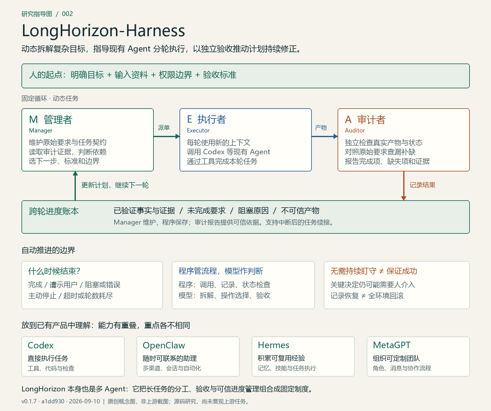

# 003 · LongHorizon-Harness

> **核心能力：将复杂目标动态拆解为可执行、可验证的子任务，指导现有模型与 Agent 按计划分轮推进；通过管理与执行分工、独立审查、可信进度记录和失败反馈持续修正计划，并支持中断后的任务续接。在目标、工具、权限与验收条件充分时，可以无需人持续盯守地推进，直到完成、需要人介入、遇到阻塞或达到运行限制。**

[返回总索引](../../README.md) · [完整研究](research.md) · [在线存档](https://yydshly.github.io/0911_codex_project/003-longhorizon-harness/) · [离线网页](web/dist/index.html) · [研究记录](notes.md) · [指导图 PNG](assets/guide.png) · [可编辑 SVG](assets/guide.svg)

## 项目信息

| 字段 | 内容 |
| --- | --- |
| 编号 | 003 |
| 上游 | [AMAP-ML/LongHorizon-Harness](https://github.com/AMAP-ML/LongHorizon-Harness) |
| 研究版本 | v0.1.7；`a1dd930614972b92361c1b9cd6aac441a6db5a65`；提交日期 2026-08-20 |
| 研究日期 | 2026-09-10 |
| 技术栈 | Python 编排和 CLI 适配；FastAPI / WebSocket；React 工作台 |
| 上游许可 | [MIT 原文](https://github.com/AMAP-ML/LongHorizon-Harness/blob/a1dd930614972b92361c1b9cd6aac441a6db5a65/LICENSE) |
| 研究状态 | 已整理：文档与核心源码研究完成；上游任务运行未复现 |
| Web 存档 | 纯静态 HTML，可离线打开；不是上游工作台或真实 Agent 演示 |
| 在线地址 | [GitHub Pages 正式存档](https://yydshly.github.io/0911_codex_project/003-longhorizon-harness/) |
| 首次部署 | [成功的发布任务](https://github.com/yydshly/0911_codex_project/actions/runs/34477023345)，提交 `9dc501b1926baac79be8c371b07eebe96ba299e0` |

## 整体指导图



原创指导图，不是上游界面截图。PNG 便于查看，SVG 可编辑放大。[图片说明](assets/README.md)

## 我们形成的理解

- 自动组织“明确要求 → 规划 → 执行一部分 → 独立验收 → 更新进度 → 继续”。
- 管理—执行—审计的顺序固定，每轮具体任务依据当前证据动态决定。
- 本身也是多 Agent 方案；MetaGPT 同样可以实现分工、验收和返修。
- Codex 等后端提供实际操作能力；LongHorizon 协调调用、上下文和跨轮进度，不训练新模型。
- 不必逐轮人工批准，但可能需要澄清、决策、权限配置或最终复核。
- 程序能要求检查流程被执行，不能保证模型判断无误；任务记录恢复不等于全环境回滚。

完整文档覆盖能力、原理、管控、产品对比、人工边界、场景、评测、成本、局限、意义、扩展与试验方案。

## 阅读与运行

访问 [正式在线存档](https://yydshly.github.io/0911_codex_project/003-longhorizon-harness/)，或直接打开 [离线网页](web/dist/index.html)。无远程脚本、无账户、无模型调用；包含全部正文与指导图，浏览器打印可保存 PDF。

可选本地服务（仓库根目录）：

```powershell
python -m http.server 8133 --bind 127.0.0.1 --directory projects/003-longhorizon-harness/web/dist
```

服务运行时访问 `http://127.0.0.1:8133/`。它仅为本机地址，不是公网部署。

## 维护方式

`research.md` 是完整正文的唯一维护源。修改后在本子项目执行：

```powershell
python -m pip install -r requirements-archive.txt
python build_archive.py
python verify_archive.py
```

生成器同步 HTML、可下载正文和指导图，避免内容分叉。依赖仅属于存档工具，不是上游依赖。纯阅读无需安装。

已通过仓库统一 GitHub Pages 流程发布，清单为 `docs/web-demos.json`。Sites 静态目录配置作为可选移交配置保留，未创建任何 Sites 项目。发布后应对实际线上文件进行校验，不能把本地构建成功当作部署成功。

线上验证可使用 `python verify_archive.py --online-url https://yydshly.github.io/0911_codex_project/003-longhorizon-harness/ --online-commit 完整已发布提交号`。验证器对比该提交的实际文件字节，并分别记录已验证的线上版本与当前本地文件是否一致；仅运行本地检查不会冒充新的线上检查。

## 研究边界

- [x] 核对上游版本、许可、主循环、角色提示词与恢复逻辑
- [x] 完整讨论归档、同类产品对比及原创指导图
- [x] 检查正文同步、内部链接、图片和本地 HTTP 访问
- [ ] 本机运行上游 MEA 任务与复现成效
- [ ] Windows 桌面操作和后端权限实测
- [x] 在线部署并验证实际地址（已验证版本与文件记录见 verification.json）

## 来源与改动

本目录保存原创中文研究、图解和静态阅读页面，没有引入上游程序源码或宣传图。源码链接固定提交；其它产品对比按研究日期记录。作者评测不代表我们的复现结果。
