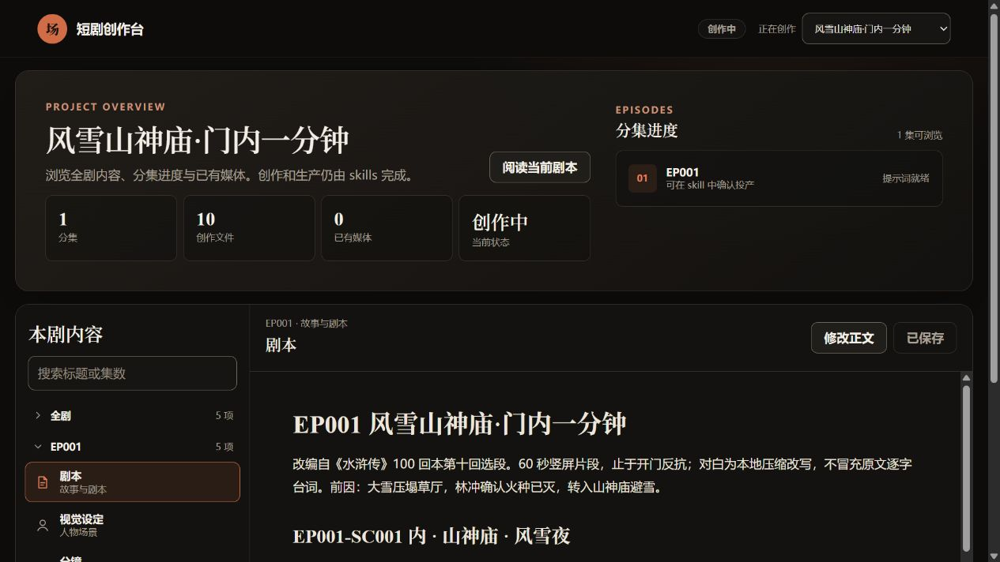

# 008 · Drama Skills · AI 短剧与漫剧创作工作流

> **支持从小说或一句话点子生成短剧：开发故事、编写分集剧本、确定视觉设定、设计分镜与生成提示词；接入外部模型后生产图片、视频、配音和音乐，再剪辑成片，并支持任意阶段审查。**
>
> 面向编剧、编导、漫剧工作室与独立创作者。它将专业方法、文件交接和程序检查交给 Agent 执行，帮助减少长材料遗漏、跨镜不一致与制作交接中的返工。

[中文网页与运行说明](app/README.md) · [返回总索引](../../README.md#项目索引) · [先看能力与产物](capabilities.md) · [技术原理与研究记录](notes.md) · [配图说明](assets/README.md) · [原库](https://github.com/zenstory-ai/drama-skills)

## 实际场景演示：一句话点子与已有原著

**现在有两个入口案例：[查看演示合集](demos/README.md)。** [《空房签收》](demos/empty-room/README.md)从一句话点子开始，已完成创作简报、故事引擎、三集规划、首集六镜与提示词，并实际生成六格展示图；[《水浒传》](demos/shuihu/README.md)从已有原著选段开始。两例在同一个原库创作台的项目选择器中切换。

当前按用户要求聚焦图片与提示词，暂不执行视频生成。[提示词使用指南](demos/shuihu/提示词使用指南.md)已汇集 1 张六格叙事板、1 张美术参考板和 6 张冻结画面的完整提示词；[内置直接生图记录](demos/shuihu/生成记录/直接生图提示词.md)保存真实请求与结果。

先看[技能与效果逐步对照](demos/shuihu/技能与效果逐步对照.md)：11 个上游技能逐项对应本次输入、操作、可查看产物和完成边界；六个镜头分别说明相关技能，重点演示“放枪—搬石—重新持枪”的交接。

[打开《风雪山神庙·门内一分钟》演示](demos/shuihu/README.md)：从有来源的原著选段，形成 60 秒剧本、人物与道具设定、六镜分镜和生成规格。已运行上游初始化、选段索引与本地创作台；图片生成与结构检查的实际结果见[演示记录](demos/shuihu/演示记录.md)。

本机实际运行截图，非网页仿制。未生成视频成片。另新增中文静态展示页，发布待验证；原库创作台仍只在本机运行。

## 先看它能做什么

按“左侧已有材料 → 中间技能与产物 → 右侧交付结果”阅读。覆盖 1 个总入口与 10 个专业技能；底部说明任意阶段的审查入口。各阶段可独立使用，文字材料可直接交付，继续生产时才需要生成服务与后期工具。[高清 PNG](assets/capability-workflow.png) · [矢量 SVG](assets/capability-workflow.svg) · [早期简版概览](assets/capabilities.svg)。

中文原创流程图，依据固定提交 `dc9b0fa` 的技能与实现整理；非上游界面截图、模型生成样片或本地生产实测结果。

| 你手里有什么 | 可以让它做什么 | 得到什么 |
| :--- | :--- | :--- |
| 一个点子、题材或梗概 | 开发人物冲突、故事引擎和分集计划，再写单集 | 创作简报、分集地图、剧本 |
| 一部长篇小说 | 建章节索引、抽样快评、逐章提取戏剧功能、归并人物与剧情单元 | 可追溯的原著分析、改编价值判断与分集候选 |
| 已经写好的单集剧本 | 提取人物、造型、地点、道具及本集状态 | 视觉设定、参考图提示词 |
| 剧本与必要视觉设定 | 设计镜头职责、景别、时长、动作起终点和冻结关键帧 | 分镜与关键帧提示词 |
| 已有分镜和参考素材 | 写逐镜动作、表演、运镜、声音及参考图使用要求 | 视频提示词与时间线音乐规格 |
| 已确认的提示词和可用生成服务 | 预览任务，经明确确认后调用外部适配器 | 图片、视频、配音或音乐素材，以及运行记录 |
| 已生成的视频素材 | 判断可用片段、安排入出点、拼接、字幕和响度 | 剪辑单与成片 |
| 任何阶段的已有产物 | 查来源、遗漏、连续性与制作问题，提出具体修订要求 | 有位置、证据、影响与责任归属的审查意见 |

**可从已有材料直接进入对应阶段。** 原著分析、故事开发、视觉方向探索与审查按需使用，不必为流程完整补造上游文件。各技能可独立安装；详细入口见[能力目录](capabilities.md#全部技能入口)。

## 适合谁，解决什么问题

- **个人创作者与小团队：** 把写作、视觉、分镜和提示词串起来，让下一步有明确输入。
- **小说改编团队：** 保存章节依据与处理进度，减少漏读、混淆和断点重做。
- **已有剧本的制作团队：** 将文本中的动作、对白与关键信息落实到具体镜头和声音。
- **Agent 工作流研究者：** 学习专业知识、稳定文件、责任边界与机械检查如何共同工作。

## 能力边界

| 原库已有能力 | 使用条件与边界 |
| :--- | :--- |
| 生成剧本、分镜和提示词 | 依赖承载技能的 Agent 与大模型；创作质量需人工或语义审查 |
| 保存连续性约束并检查文档引用 | 能减少规格矛盾，不能保证模型输出绝不换脸、穿帮或动作漂移 |
| 图片、视频、TTS 与音乐生产接口 | 需要适配器、账号与凭据；有通用接口不代表每种媒体都有现成可用后端 |
| 按剪辑单渲染已有素材 | 需要真实素材与 FFmpeg/FFprobe；生成成功不等于质量达标 |
| 本地创作台浏览和编辑 | 属于原库已有界面；生产请求仍通过对话与生产工具处理 |
| 当前资料导出与审查记录 | 导出快照不自动代表内容已获批准；审查也不保证市场表现 |

## 项目信息与当前状态

| 项目 | 内容 |
| :--- | :--- |
| 研究索引 | 008；按本次登记时已有子项目最大研究索引 007 加一 |
| 存储目录 | `006-drama-skills`；与研究索引独立，保留创建时的历史目录编号 |
| 上游仓库 | [zenstory-ai/drama-skills](https://github.com/zenstory-ai/drama-skills) |
| 研究版本 | [`dc9b0fac15225629856f17ca06640b470c89cfca`](https://github.com/zenstory-ai/drama-skills/tree/dc9b0fac15225629856f17ca06640b470c89cfca)（2026-09-10） |
| 收录日期 | 2026-09-10 |
| 技术组成 | Agent Skills、Markdown、Python；本地创作台使用 HTML/CSS/JavaScript；剪辑依赖 FFmpeg |
| 上游许可证 | [MIT 原文](https://github.com/zenstory-ai/drama-skills/blob/dc9b0fac15225629856f17ca06640b470c89cfca/LICENSE)；示例小说等素材需分别核对其用途说明 |
| 研究状态 | 研究中：能力研究与部分离线测试完成；已运行水浒原著改编与《空房签收》一句话开发案例，后者实际获得六格图片 |
| 验证结果 | 所选 145 项离线测试中 142 项通过、3 项跳过；《空房签收》通过宿主 imagegen 实际生成展示图；未执行上游生产适配器或剪辑成片 |
| 展示入口 | [两种入口演示合集](demos/README.md)、[《空房签收》](demos/empty-room/README.md)、[《水浒传》](demos/shuihu/README.md)、[完整流程图](assets/capability-workflow.png) |
| 在线演示 | 中文静态展示页已构建，发布待验证；原库创作台仅本地运行，不提供在线生成 |

## 本地新增内容与后续研究

本次新增中文能力目录、用于解释交接方式的原创微型案例、能力总览图和技术研究记录。它们是本地研究材料；图中能力来自上游，微型案例不是上游实跑成果。

- [x] 确认上游仓库、固定版本与许可证
- [x] 展示原库能力、输入、产物和使用条件
- [x] 整理技术原理与部分离线验证记录
- [x] 添加原创能力示意图
- [ ] 用原创短剧完成真实端到端制作，保存素材与成本证据
- [x] 获取真实创作台截图
- [ ] 获取已验证的视频成片
- [x] 建设中文静态展示，发布状态见上表；遵循[统一发布约定](../../docs/web-demos.md)

当前无需安装依赖即可阅读研究材料。本项目没有复制上游执行代码或全局安装技能；《水浒传》演示调用本机临时目录中的固定上游版本。复核已记录测试可参考[独立复现命令](notes.md#离线验证记录)。

## 中文网页

新增公开阅读页面，以本页完整流程图作为引导，提供 7 种材料入口、11 个技能职责、两种案例的 12 个步骤及 24 份可阅读资料。展示实际图片和偏差，可复制剧本或提示词。技术原理、团队价值和扩展方向集中整理；不提供在线生图与后台编辑。

[构建、检查与预览](app/README.md)。发布按 GitHub Pages 统一约定，部署结果待远端验证。
