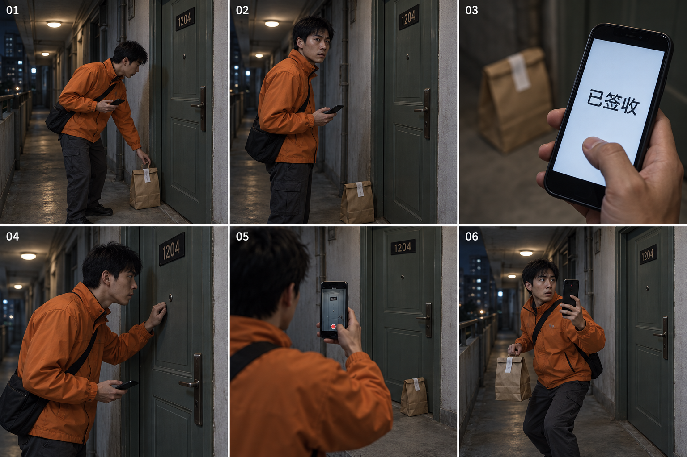

# 《空房签收》六格展示图

来源：首集的剧本、视觉设定与六镜设计。展示图属于本地汇总展示形式，实际调用 Codex 内置 imagegen；不宣称执行了原库 produce 适配器。画面为代表性时刻，不是六张视频起始帧。

## 实际提交提示词

画一张中国都市悬疑短剧《空房签收》的六格电影故事板，横向构图，三列两行，细白分隔线，格角仅标01到06。写实电影概念插画，克制的悬疑，青灰楼道与暖白顶灯。六格同一个中国男性外卖员许川，28岁，瘦长脸、短黑发、无胡须，穿无商标橙色外卖夹克与深灰长裤，黑色斜挎带；手持黑壳手机，餐品是贴着完整白色封口贴的牛皮纸外卖袋。夜间旧公寓十二层走廊，同一扇关闭的灰绿色金属房门，黑色门牌1204，门右侧灰墙，走廊无其他人。01：许川站门前，右手持手机，左手刚把封口纸袋放到门边地面，准备敲门。02：他听见门内与自己相同的声音，突然停住，嘴唇闭合，盯住关闭的门；纸袋留地面，手机仍在右手。03：手机屏幕特写，界面只有简洁的大字“已签收”，右手拇指悬空没点屏幕，背景门边纸袋虚化。04：半身侧面，他右手手机垂在腰间，左手刚敲了门后停在门板前，侧耳等答复。05：过肩镜头，右手将手机竖举对准房门录像，屏幕简单红色录像圆点，左手空着，门始终关闭、纸袋在门边。06：他左手提回同一个完整封口纸袋，右手持续举手机录像，向后退两步，惊惧中保持警觉，灰绿色房门仍紧闭。清晰的物理连续性，同一人物服装、同一门、同一纸袋。门内人物始终不出现，禁止鬼影、第二个外卖员、血腥、品牌、水印或对白气泡。除了01—06、门牌1204与第3格“已签收”，不加其他文字。这是单张叙事展示图，不是视频。

## 结果

内置 imagegen 已返回真实图片，已复制到项目：[storyboard-v1.png](../剧集/EP001/制作成果/images/storyboard-v1.png)，尺寸 1536 × 1024。该文件已经在原库创作台中实际载入。

首版视觉核对：六格顺序、橙色夹克、1204 房门、封口餐袋和“已签收”文字已出现。第 3 格拇指与屏幕的接触关系不够明确；第 6 格左右手持物与剧本不一致，录像朝向也需明确。首版作为真实生成过程证据保留，不直接充当逐镜视频起始帧。

随后实际提交了只针对第 3、6 格的定点修订，但编辑服务连接失败，没有获得修订版。[完整编辑指令与回执](定点修图.md)。当前保留首版作为带明确偏差的真实演示结果。
