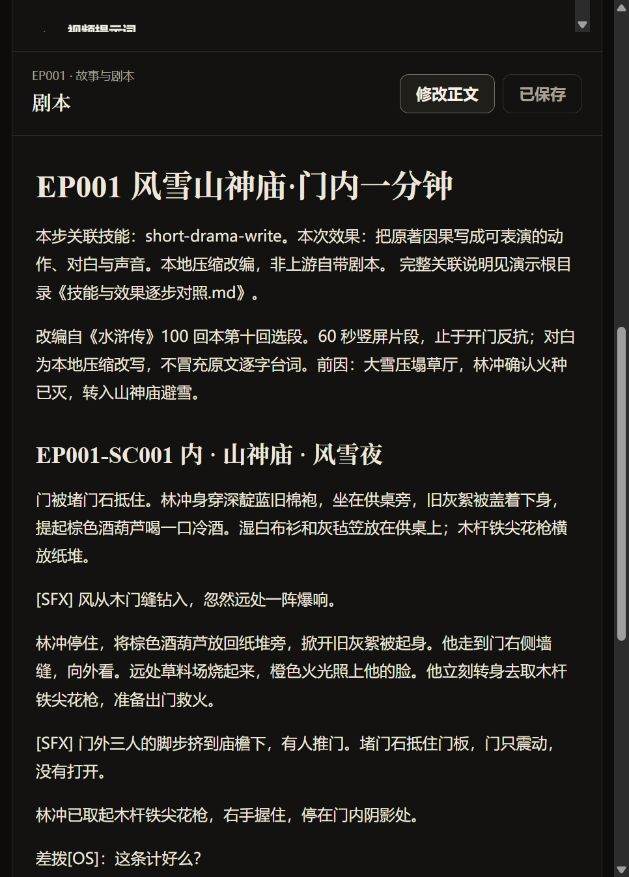

# 《水浒传》逐步效果与原库技能对照

[返回演示](README.md) · [当前生成记录](演示记录.md) · [全部能力](../../capabilities.md)

## 先理解谁在做什么

**当前阶段已按用户要求调整为图片和提示词演示，暂不执行视频生成。** 内置 imagegen 可直接使用，不要求用户配置 API 密钥。下文保留原库全流程以便理解；视频接入与剪辑属于后续阶段。[最新直接生图记录](生成记录/直接生图提示词.md) · [提示词使用指南](提示词使用指南.md)。

**原库提供创作方法、文件约定、检查脚本和生产接入；当前 Agent 按这些方法创作《水浒传》内容；图像与视频模型负责生成真实媒体。** 这三部分共同构成演示，不能把任何一部分的效果都归给原库。

本页锁定上游提交 `dc9b0fac15225629856f17ca06640b470c89cfca`。技能名称都链接到该版本的原文。下文“按技能创作”表示读取方法后由当前 Agent 执行，不表示调用了一个同名神经网络或让上游脚本自动写作，也不表示已全局安装这些技能。

| 类型 | 本次例子 | 如何判断是否真的发生 |
| :--- | :--- | :--- |
| 原库程序执行 | 初始化项目、原著索引、源文件复核、五文档检查、本地创作台 | 有配置、索引、检查输出和真实截图 |
| 按原库技能创作 | 改编剧本、视觉设定、分镜、提示词 | 可以逐段阅读文件，核对其输入与下游；不等于已通过终审 |
| 外部媒体生成 | Codex 内置 imagegen 的六格分镜板请求 | 以真实工具回执和保存的图像为准；提示词文件不是出图证明 |
| 上游有、这次未实跑 | 整季开发、原库生产适配器、配音音乐、剪辑成片 | 明确标注未执行，不计算为本次完成效果 |

## 全流程对照：每一步拿到什么

这是本轮真实运行截图。五份制作材料顶部都已加入相同结构的关联说明；完整上游链接与证据集中在下表。截图是创作台中的文档效果，不是生成的水浒画面。

表中状态针对本次选段演示。媒体状态可能继续变化，以[生成记录](演示记录.md)为准。

| 步骤 | 上游技能与已有职责 | 我们的输入 → 实际效果 | 产物证据与状态 |
| :--- | :--- | :--- | :--- |
| 01 建项目 | [short-drama](https://github.com/zenstory-ai/drama-skills/blob/dc9b0fac15225629856f17ca06640b470c89cfca/skills/short-drama/SKILL.md)：建立配置、组织入口、提供创作台与机械检查 | 以林冲风雪山神庙为题 → 1 集、60 秒目标、9:16 项目；创作台可阅读五文档 | [配置](short-drama.json)、[真实界面截图](生成记录/dashboard-script.png)。上游程序已运行；制作档案仍未设置 |
| 02 找原著依据 | [short-drama-novel-analyze](https://github.com/zenstory-ai/drama-skills/blob/dc9b0fac15225629856f17ca06640b470c89cfca/skills/short-drama-novel-analyze/SKILL.md)：对长材料定位、分析戏剧功能，支持可复核索引 | 100 回本第十回的六段节选 → 保留“先想救火，后听出谋害”的因果 | [原文](输入/原著选段.txt)、[改编依据](项目开发/原著分析/改编决定.md)、[索引](项目开发/原著分析/选段索引.json)、[复核结果](验证记录/source-index.txt)。程序复核通过；未分析整部小说 |
| 03 定改编范围 | [short-drama-develop](https://github.com/zenstory-ai/drama-skills/blob/dc9b0fac15225629856f17ca06640b470c89cfca/skills/short-drama-develop/SKILL.md)：开发冲突、改编方向、故事引擎和分集地图 | 本次仅选门内一分钟，止于开门；取舍写进改编决定 | [改编决定](项目开发/原著分析/改编决定.md)。仅作职责对应；没有执行完整系列开发，也没有生成其标准简报、故事引擎或分集地图 |
| 04 写成戏 | [short-drama-write](https://github.com/zenstory-ai/drama-skills/blob/dc9b0fac15225629856f17ca06640b470c89cfca/skills/short-drama-write/SKILL.md)：把戏剧目标落实到行动、对白与声音 | “发现阴谋” → 门外画外对白、林冲辨认声音、绷紧下颌、主动开门 | [剧本](剧集/EP001/剧本.md)。已按技能写作；对白是本地压缩改写，60 秒尚未实测 |
| 05 固定视觉事实 | [short-drama-assets](https://github.com/zenstory-ai/drama-skills/blob/dc9b0fac15225629856f17ca06640b470c89cfca/skills/short-drama-assets/SKILL.md)：区分身份、造型、地点和道具状态 | 同一个林冲、同一间庙 → 棉袍不换；枪、石头、葫芦、白布衫分别有明确位置 | [视觉设定](剧集/EP001/视觉设定.md)。文本已完成；尚不能据此宣称生成画面一致 |
| 06 写出图要求 | [short-drama-image-prompts](https://github.com/zenstory-ai/drama-skills/blob/dc9b0fac15225629856f17ca06640b470c89cfca/skills/short-drama-image-prompts/SKILL.md)：把视觉事实转成参考图要求 | 林冲与山神庙设定 → 人物、场景、道具美术板提示词 | [图片提示词](剧集/EP001/图片提示词.md)。已完成文本；六格叙事板是本地新增展示请求，见下方区别 |
| 07 拆成六镜 | [short-drama-storyboard](https://github.com/zenstory-ai/drama-skills/blob/dc9b0fac15225629856f17ca06640b470c89cfca/skills/short-drama-storyboard/SKILL.md)：为镜头分配目的、景别、时长、动作起终点与冻结关键帧 | 一场戏 → 饮酒、望火、止步、识破、搬石、开门六镜 | [分镜](剧集/EP001/分镜.md)。6 镜各规划 10 秒；起点和代表性画面分开描述 |
| 08 写运动与声音 | [short-drama-video-prompts](https://github.com/zenstory-ai/drama-skills/blob/dc9b0fac15225629856f17ca06640b470c89cfca/skills/short-drama-video-prompts/SKILL.md)：把镜头翻译成模型可接收的运动、声音和参考要求 | 第 5 镜 → 0—2 秒放枪、2—8 秒搬石、8—10 秒重握枪 | [视频提示词草案](剧集/EP001/视频提示词.md)。有草案；缺真实参考图和目标模型，不能作为最终生产规格 |
| 09 真正生成媒体 | [short-drama-produce](https://github.com/zenstory-ai/drama-skills/blob/dc9b0fac15225629856f17ca06640b470c89cfca/skills/short-drama-produce/SKILL.md)：用有边界的任务调用配置好的适配器，保存结果及运行记录 | 本次使用 Codex 内置 imagegen 继续请求六格画面 | [本轮请求与回执](生成记录/本轮继续生成.md)。本次外部工具出图路线不等于已运行原库 produce 适配器；视频、TTS、音乐未执行 |
| 10 剪成片 | [short-drama-edit](https://github.com/zenstory-ai/drama-skills/blob/dc9b0fac15225629856f17ca06640b470c89cfca/skills/short-drama-edit/SKILL.md)：从已有素材选择可用区间、安排镜序与声音并输出成片 | 应以真实六镜视频为输入 → 当前没有可剪视频 | 未执行；不拿静态幻灯片冒充生成短片 |
| 11 查问题 | [short-drama-review](https://github.com/zenstory-ai/drama-skills/blob/dc9b0fac15225629856f17ca06640b470c89cfca/skills/short-drama-review/SKILL.md)：针对来源、内容、连续性与已有媒体写证据和修订要求 | 检查道具交接、原著改写、缺失素材 → 保留待补项和限制 | [语义自检](审查/EP001-审查.md)、[机械检查输出](验证记录/creator-check.txt)。自检非独立终审；机械检查属于 core 工具，二者职责不同 |

## 逐镜看效果：每格分别体现哪些技能

这里描述的是已有分镜的设计效果，实际画面是否达到它，需要在出图后核对。

| 画面 | 我们想让观众看到什么 | 最直接关联的技能 | 可以检查的具体效果 |
| :--- | :--- | :--- | :--- |
| 01 饮酒避寒 | 林冲暂时躲过风雪，但仍很脆弱 | write + assets + storyboard | 被子盖下身、葫芦在手、枪在纸堆；异常声音打断安稳 |
| 02 墙缝望火 | 外面的火让避寒变成危机 | novel-analyze + write + storyboard | 他先放酒器与被子再起身；火在草料场，不在庙内 |
| 03 持枪止步 | 他原本想救火，却被门外动静阻住 | novel-analyze + storyboard + video-prompts | 取枪、走向门、停步有因果；堵门石仍抵住关闭的门 |
| 04 听出死局 | “即使没烧死，也难逃死罪”，旧友参与谋害 | write + storyboard + video-prompts | 两句画外对白由近景反应承接，观众理解变化来自听见的话 |
| 05 放枪搬石 | 主角从忍耐转向行动 | assets + storyboard + video-prompts | 双手搬石之前先放枪；搬完再拿枪，不出现多余手臂或道具瞬移 |
| 06 持枪开门 | 林冲主动面对门外的人 | write + assets + storyboard | 右手持枪、左手开门、石头已移开；一声喝止后切黑 |

## 透视一条完整交接：第 5 镜“搬石”

同一个动作经过各步骤，不是在五个文件里简单重复一句话，而是逐步增加下一阶段需要的信息。

1. **原著依据 / novel-analyze**：堵门石必须移开才能出门；林冲听清谋害后决定反抗。
2. **可表演动作 / write**：写成“先把枪靠墙，再双手搬石，起身重新握枪”。这是本地为动作清楚而细化的调度，不冒称每个细节均为原文。
3. **状态约束 / assets**：枪从右手到侧墙再回右手；石头从门前到门内左侧。这里回答“东西在哪里”。
4. **镜头承担 / storyboard**：全身中景，保留落石空间，规划 10 秒；起始画面是“枪仍在手、石头仍堵门”，回答“观众从哪一刻看起”。
5. **生成过程 / video-prompts**：把放枪、搬石、重握枪安排进时间段，补上摩擦声与呼吸，回答“这张起始画面如何运动”。
6. **生成执行 / produce 职责**：把已定规格和真实输入交给服务。当前内置生图尝试只出展示用代表画面，尚未执行这一镜的视频任务。
7. **结果核对 / review 职责**：拿返回的画面或视频逐项检查枪、手、石头与门的位置。没有媒体时，只能审文本，不能下画面质量结论。

如果出图时出现“一手拿枪、一手搬石”，应首先核对提示词是否正确传入；传入正确而画面错误，属于模型执行偏差，应针对这张图修订或重生成，不能宣称技能保证了连续性。

## 三种图不能互相冒充

| 产物 | 用途 | 本例 |
| :--- | :--- | :--- |
| 美术参考板 | 约束人物身份、服装、场景材质与道具外形 | canonical 图片提示词中的 `IMG-SHUIHU-REFERENCE` |
| 单镜冻结起始帧 | 给视频一个准确的时间起点 | 第 5 镜应是林冲尚持枪、尚未搬石 |
| 六格叙事板 | 让人快速看懂剧情与视觉方向 | 第 5 格可展示正在双手搬石的代表性时刻；不能把整张六格板直接当六镜起始帧 |

本次六格图的提示词由已有剧本、视觉设定和分镜汇总而来，是**本地新增展示形式**。真实请求按宿主本地 imagegen 技能，通过 Codex 内置工具发起；它不是 Drama Skills 的第 12 个技能。请求正文和回执另行保存，不制造上游生产账本。

## 当前“效果”到底验证到了哪里

- **来源层**：选段索引复核通过，证明索引与本地节选一致；不证明文学理解自动正确。
- **创作层**：五份文档已形成，可以沿来源、动作、视觉状态和镜头逐步核对；视频文件仍是草案。
- **工具层**：原库创作台确实打开了这些文件；机械检查发现缺参考素材并返回阻断。
- **媒体层**：以[本轮记录](生成记录/本轮继续生成.md)和实际输出为准；失败、生成成功与质量验收分别记录。
- **生产接入层**：当前进程未配置 Seedance / MiniMax 所需的视频凭据及模型，项目制作档案未设置；这与图像服务的连接失败是两个不同缺口。
- **成片层**：没有真实视频，尚不能评价表演、口型、镜头衔接、混音和成片效果。

创作台显示“提示词就绪”只是其文件进度判断，不能替代媒体准备和生产检查。查看结果应先看实际文件与检查输出，再看界面标签。

## 对我们的意义与下一步扩展

我们已经能用同一段故事解释每个技能的责任，也能定位返工发生在哪一层。例如“枪消失”要沿视觉设定、提示词、模型输出检查，而“剧情突然跳到报仇”要回到原著分析和写作。

后续可在此基础上增加“点击镜头 → 查看原文依据、剧本动作、提示词、真实输出、审查意见”的展示界面，以及不同模型的同镜头效果和成本对照。这些属于本地可扩展方向，当前没有实现，也不归入原库已验证能力。
