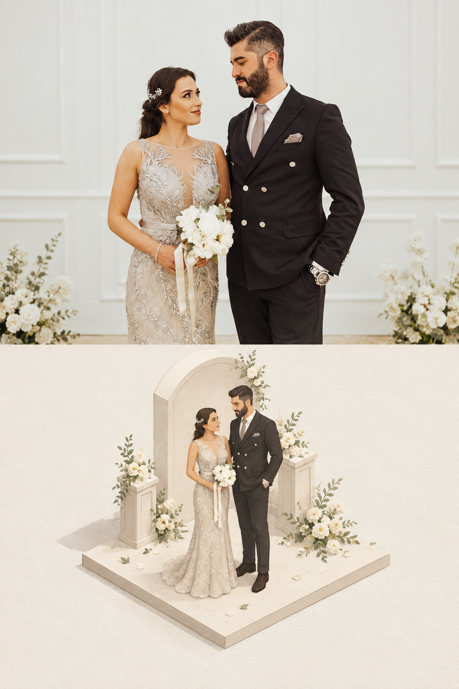
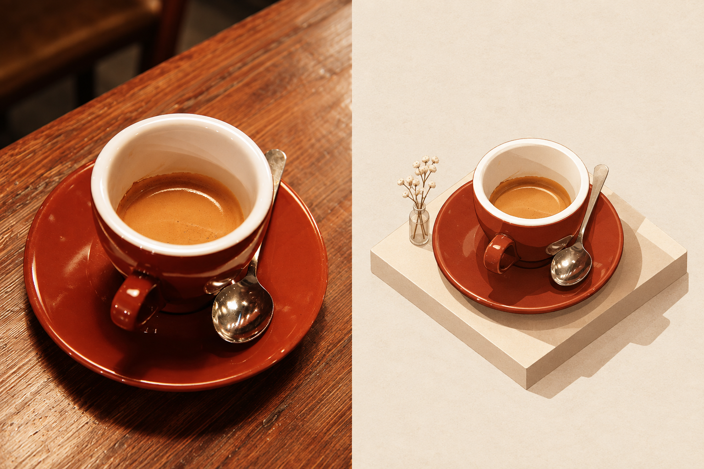
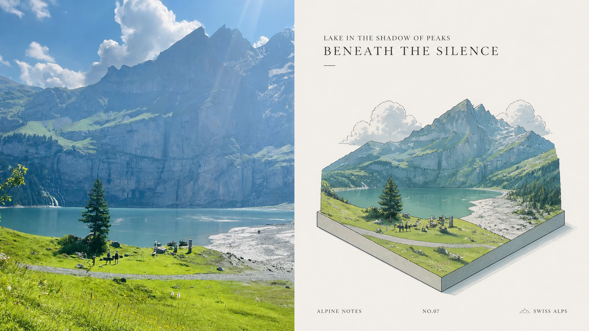

# 009 · XXD Panel 028

> 将照片中的主体、姿态、关系与源图配色，按等距视角、纸面材质、基座和留白规则转译为二维微缩插画。原库以 Agent Skill 封装审美提示词、多模式、多比例、文字控制、批量与验收流程；实际图像理解和绘制由接入的图像模型完成，不输出可编辑三维对象。

[我们的理解与价值边界](understanding.md) · [微缩场景效果与说明](extensions/miniature-scenes/README.md) · [扩展效果说明](extensions/style-lab/README.md) · [扩展实际图片与提示词](runs/20260910-style-extensions-03/README.md) · [返回总索引](../../README.md#项目索引) · [研究笔记](notes.md) · [此前四场景实测与实际提示词](runs/20260910-real-scenes-01/README.md) · [展示页源文件](app/index.html) · [配图与来源](assets/README.md) · [上游仓库](https://github.com/nevertoday/xxd-panel-028)

## 项目信息

| 项目 | 内容 |
| :--- | :--- |
| 研究索引 | 009 |
| 历史存储目录 | 007-xxd-panel-028；创建时 005、006 已被其他项目占用 |
| 上游仓库 | [nevertoday/xxd-panel-028](https://github.com/nevertoday/xxd-panel-028) |
| 研究版本 | [3194d43ba95edbad0082b3604959e45067f72b7e](https://github.com/nevertoday/xxd-panel-028/commit/3194d43ba95edbad0082b3604959e45067f72b7e)，2026-09-08 |
| 收录日期 | 2026-09-10 |
| 上游技术 | Markdown Skill、宿主 Agent、生图通道、Python 3.11+ 与 Pillow |
| 本地技术 | 原生 HTML / CSS / JavaScript；Node.js 22+ 构建检查，无第三方依赖 |
| 上游许可证 | [PolyForm Noncommercial 1.0.0](UPSTREAM-LICENSE.txt)，含非商业用途限制 |
| 研究状态 | 研究中；已按固定上游 Skill 实测七个场景、共十二次生成，保留验收偏差 |
| 展示状态 | 以淡蓝花艺微缩扩展成品为主预览；补充原库能力、本地扩展、二维／三维区别与产品价值边界；发布待验证 |
| 部署方式 | 已并入仓库 GitHub Pages 清单，待实际发布验证 |

## 我们的理解

原库的核心是以微缩美学指导图像模型创作二维画面。人物、物件与场地是参考内容，不是已经分离的可编辑对象；多图组合和局部定制是本地扩展。点击介绍、故事纪念与方案表达需要额外产品功能，价值仍需用户验证，不能由图片效果推导。详见[完整理解](understanding.md)。

## 微缩场景扩展实测

固定原库纸面微缩语言，新生成六张效果图：人物＋真实场地、咖啡与海边故事、四主题生活地图、花艺局部定制、真实厨房切面。多图组织、故事、地图和局部编辑属于本地场景扩展，人物经历与组合场地不作事实断言。

[五类扩展方式](extensions/miniature-scenes/README.md) · [六张实际 PNG 与完整提示词](runs/20260910-miniature-scenes-04/README.md)。本地入口：http://127.0.0.1:8028/miniatures.html 。


主预览选取花艺定制最终图：主体清楚、场景关系完整、修改可对照；属于本次编辑选择，非客观质量排名。

花艺修改前后可在页面切换；整体目视基本保持。生活地图存在尺度与分块布局偏差。六张均为实际 1536×1024，输出原样保留。动态视频和可旋转三维本轮未制作。

## 扩展效果实验

在同一婚纱照片上新增摄影与水彩风格，保留原库微缩作基准；另演示两种保留程度、家庭水彩系列和海报／相册对页／卡片版式，共五个输出任务、六次实际生成。摄影与水彩是本地扩展，不是原库内置风格。构图保留仍有偏差。

[查看方向、机制与效果](extensions/style-lab/README.md) · [查看全部原始 PNG 和完整提示词](runs/20260910-style-extensions-03/README.md)。本地扩展页面：http://127.0.0.1:8028/extensions.html 。


## 本次真实场景实测

新增婚纱双人照、亲子做饭、伴侣沙滩散步三组，使用 Pexels 的真实摄影素材，按原库提示词由内置 imagegen 完成四次生成。婚纱与家庭场景主要交付要求通过；沙滩场景两轮均未达到指定像素尺寸。全部三组都保留模型补全说明，详见[人物生活场景与实际提示词](runs/20260910-people-scenes-02/README.md)。



上图来自真实摄影转译；拱门与花柱是模型补全，摄影区域也重新生成，不能当作原片保真。

已按固定上游 Skill 的内置 imagegen 路径完成咖啡桌面、航天员肖像、火箭设施、宠物特写四组，每组一次针对性重试，共八张实际输出。所有照片来自明确公开来源；原始审美正文逐字保留，生成记录可核验。

咖啡主要交付要求通过；另外三组存在尺寸或模式偏差。航天员重试修正了模式，宠物重试却退化为双联，因此保留失败案例而不冒充全部通过。详见[实测记录及全部提示词](runs/20260910-real-scenes-01/README.md)。



本次真实生成画布；左侧摄影表达也经过模型生成，不是原片像素保留。右侧花瓶为模型补充。[真实输入](assets/real-inputs/coffee.png)单独保存。

## 上游能力与样张



上图为固定版本中的上游成品样张，原样引用，不是本地生成结果或网页截图。文字、地点与编号属于上游图像内容，未独立核实。

| 原库能力 | 工作方式与边界 |
| :--- | :--- |
| 等距微缩风格转译 | 模型概括照片的身份、姿态、关系与原有色彩，输出 PNG；不输出三维模型 |
| 四种输出模式 | 上下双联、左右双联、纯设计图、手机／平板／电脑／手表壁纸 |
| 多比例与文字控制 | 不同比例独立构图；模型文案、准确文案或无文字；仍需检查生成结果 |
| 连贯壁纸 | 先生成定调图，再以原图和定调图作为其余设备的参考 |
| 目录批量 | Skill 规定扫描、排序、隔离来源、报告成功失败；主要由 Agent 编排 |
| 偏好复用 | 脚本保存交付设置，不保存准确文案、原图或通道凭据 |

## 本地新增展示

- 原样收录 6 张上游图片，展示山湖、人物、铁路与牧场；同一山湖素材可切换横版和竖版成品。
- 解释四种输出模式、技术流程、应用场景、研究价值与扩展路线。
- 参数预览器支持多选模式与比例、原图数量、文字语言、壁纸关系；计算预计产物并复制示例命令。
- 显式区分上游样张、文档规定、本地功能和待验证建议。网页不提供实时生图、上传、账户或计费；下方实测由宿主在本次任务中执行。
- 已增加纯设计图实际运行；四端壁纸仍未实测，使用明确标注的布局示意解释。

## 运行与检查

在本目录执行（Node.js 22+，无依赖安装或锁文件）：

```text
node app/scripts/check-real-demos.cjs
node app/scripts/build.cjs
node app/scripts/check.cjs
```

构建到 app/dist/。安装 Python 时，可在本目录启动静态预览：

```text
python -m http.server 8028 --bind 127.0.0.1 --directory app/dist
```

访问本机 http://127.0.0.1:8028/，仅为本地预览。也可直接打开构建后的 HTML；剪贴板不可用时页面提供选中文本手动复制。

根目录执行 `node scripts/build-pages.cjs` 汇总已有项目与本展示。新增检查已加入 [Pages 工作流](../../.github/workflows/pages.yml)，[清单](../../docs/web-demos.json) 保留已有站点条目。

## 当前结论与验证

最值得研究的是“审美原文保持稳定、交付变量参数化、逐张生成与验收”的封装方式。它不是独立图像模型；批量、主体保真与文字控制不能仅凭 Skill 文字视为可靠性保证。尺寸校准可能缩放或裁切，四场景实测已观察到模式、文字、尺寸与内容补全偏差；完整质量评测、成本和耗时对比仍待实验。

已检查交付数量公式、多模式与壁纸组合、无效输入、命令分支、锚点及资源、脚本语法、构建一致性和发布样张的字节一致性。另已核对四组实际输入、八份实际提示词和八张生成文件的哈希、尺寸与验收记录；网页已在本地检查浏览与前后切换；线上发布待验证。

现已保存[固定上游执行快照](vendor/README.md)，含原样 Python 辅助脚本；本次遵循内置生图路径，没有运行 API 桥接脚本。引用原样图片并保留[许可证](UPSTREAM-LICENSE.txt)、[素材说明](assets/README.md)与固定提交链接。商业集成需确认授权，原始素材权利不因本展示而扩大。
