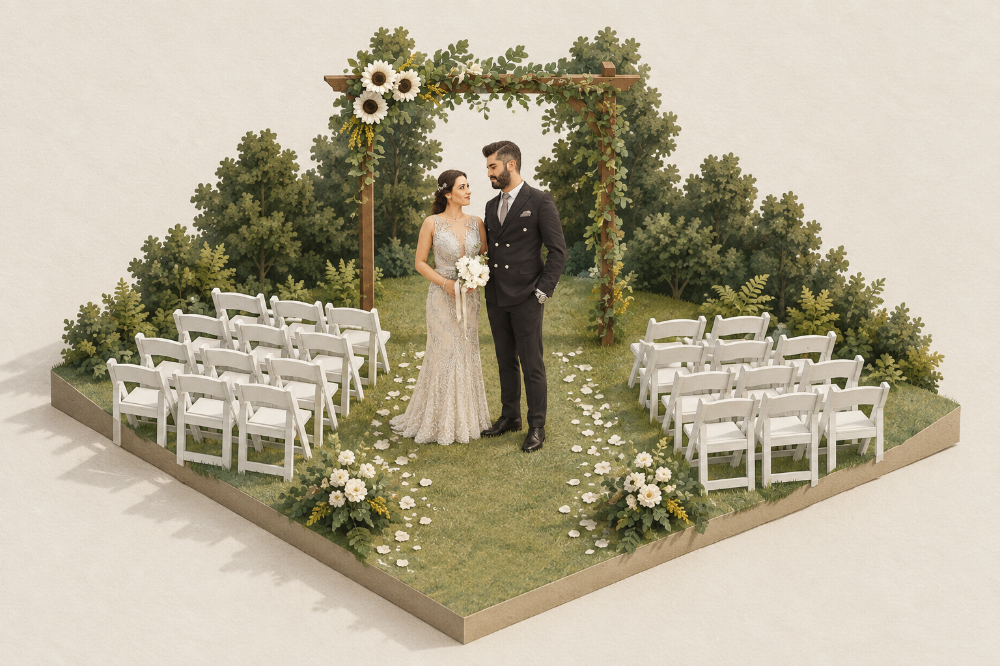
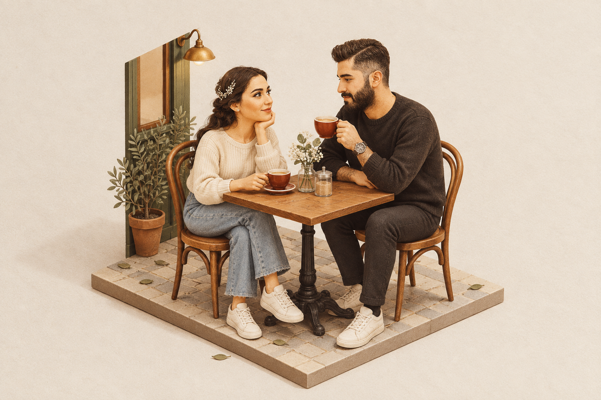
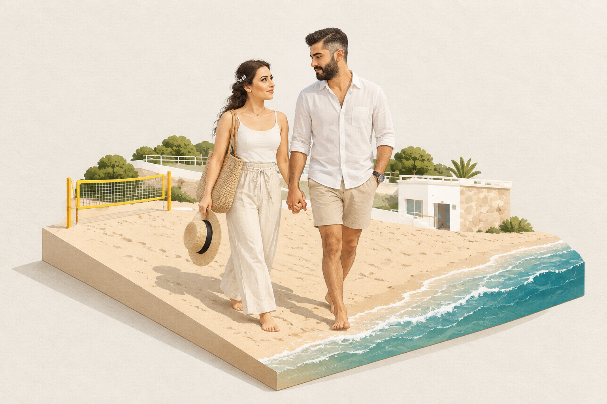
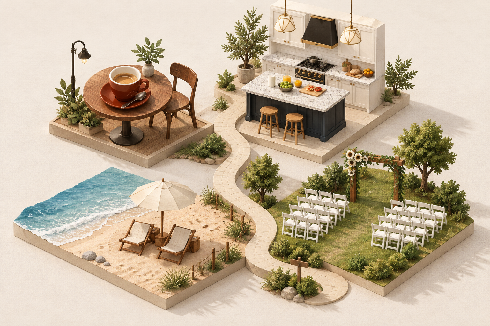
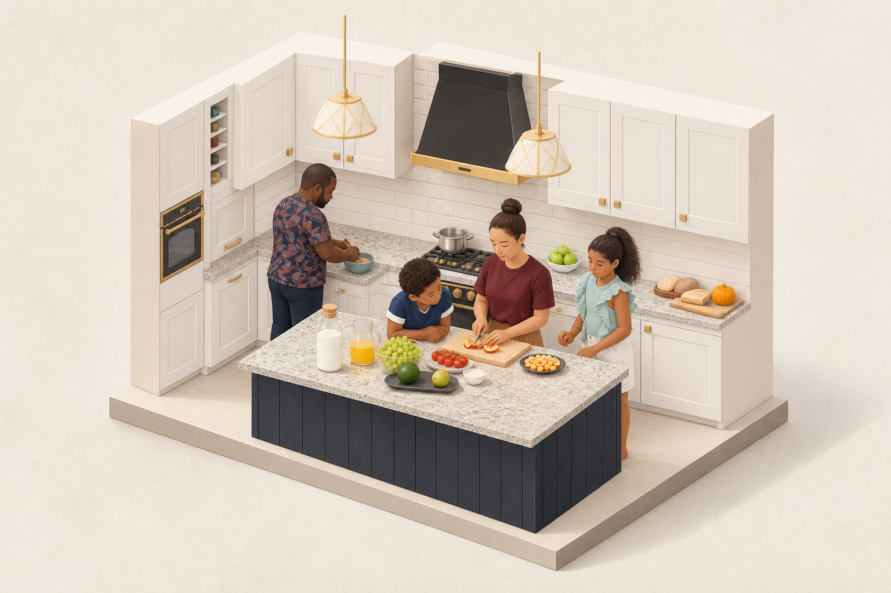

# 微缩场景扩展 · 六张真实效果

[返回项目](../../README.md) · [扩展机制](../../extensions/miniature-scenes/README.md) · [新增场地照片来源](../../assets/real-inputs/venue-source.md)

本轮共六次内置 imagegen 调用，生成六张 1536×1024 PNG。全部输出已逐张查看并原样保存，未裁切、调色、拼图或改尺寸。用户要求看到微缩场景扩展的真实效果，本轮覆盖五类静态场景扩展。

## 人物与真实场地组合

[人物原片](../../assets/real-inputs/wedding.jpg)和[场地原片](../../assets/real-inputs/venue.jpg)分别提供人物与环境。木拱门、白椅和草坪可辨；新增花瓣、地面花饰，座椅数量和场地尺度没有逐一核对。来自不同摄影作品的组合，不代表真实婚礼。

[完整提示词](prompts/venue.txt) · [运行记录](venue.json)

## 人物故事系列

两张均从同一婚纱照取得人物参考，分别借用咖啡桌面、沙滩照片的场景线索。日常服装、人物动作、咖啡馆空间、旅行与事件均属创作设定。海边未借用原海边照片的另一对人物；只做目视相似性观察，未证明跨场景人脸稳定。

[咖啡提示词](prompts/coffee-story.txt) · [咖啡记录](coffee-story.json) · [海边提示词](prompts/travel-story.txt) · [海边记录](travel-story.json)

## 生活主题地图

四类真实摄影共同提供主题，生成道路与布局。杯子尺度夸张，海边新增躺椅和伞，四个底座分块连接，未完全达到单块连续基座要求。它表达主题关联，不表示真实地理或人物生平。

[完整提示词](prompts/life-map.txt) · [运行记录](life-map.json)

## 局部定制前后

直接编辑本轮第一张微缩成品，请求将拱门与地面花饰花瓣改成淡蓝色，保留绿叶与新娘白捧花。实际结果主要修改可见，人物、座椅、木拱门和构图目视基本维持。未用像素掩膜锁定区域，也未做区域差异量化，不能宣称其他区域逐像素不变。

[修改前](../../assets/generated/20260910-miniature-scenes-04/venue-1536x1024.png) · [编辑提示词](prompts/venue-edit.txt) · [编辑记录](venue-edit.json)

## 真实厨房的空间纪念

保留四人、操作台、橱柜、黑金抽油烟机与吊灯，未见要求避免的盆栽、吧凳或地毯。几何与不可见表面由单图推断，不是房间测量、施工图或三维重建。

[原始摄影](../../assets/real-inputs/family.jpg) · [完整提示词](prompts/room.txt) · [运行记录](room.json)

## 执行依据与检查

原库提交 `3194d43ba95edbad0082b3604959e45067f72b7e` 的完整审美正文逐字保留，使用原库画布、纯设计、无文字交付块；在末尾追加本地场景扩展要求与参考角色。因此这些属于基于原库微缩语言的本地扩展，不宣称原版已支持本轮所有输入组织方式。

所有参考文件、实际请求和输出均保存哈希；六份保存提示词与实际图像工具调用逐一核对。页面提供原始输入和成品链接，并可切换花艺修改前后。没有 OCR、人脸识别评测、建筑尺寸测量、局部像素锁定或批量成功率数据。

动态视频与可旋转三维本轮未制作。可用工具没有视频生成能力；PNG 不包含几何模型，实际三维需要后续工具与制作流程。页面不展示伪装为视频或三维的静态占位。

本地预览入口：http://127.0.0.1:8028/miniatures.html 。静态页面已并入同一构建产物，尚未部署。
