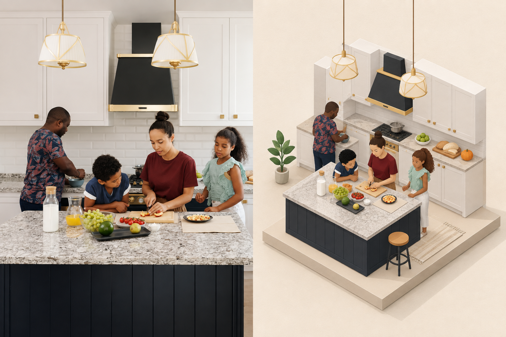
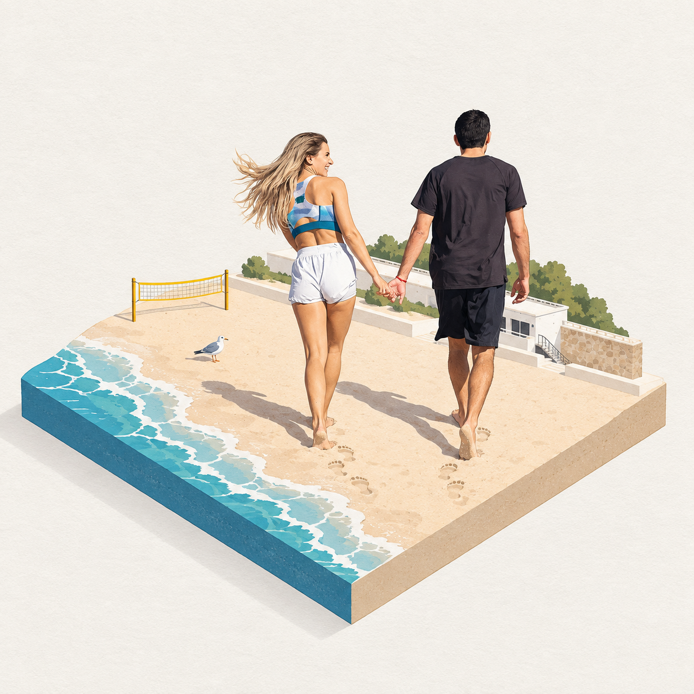

# 人物生活场景实测 · 2026-09-10

[返回项目](../../README.md) · [摄影来源与许可](../../assets/real-inputs/README.md) · [此前四场景](../20260910-real-scenes-01/README.md)

按用户“婚纱照、与人和人的生活相关”的要求，新增三张真实摄影输入，共四次实际生成。沿用固定版本 `3194d43ba95edbad0082b3604959e45067f72b7e` 的 XXD Panel 028 Skill，宿主通过内置 imagegen 执行；原库的完整审美正文逐字保留，追加原库对应模式、画布和无文字块，没有另写婚礼或家庭主题的审美提示词。具体场景由参考照片提供。

这些是真实摄影素材的艺术转译，输出是二维 PNG。人物相互关系与服装辨识度属于目视观察；未做身份识别、面貌一致性评分或真实三维重建。

| 场景 | 原图 | 模式／目标 | 实际与验收 |
| --- | --- | --- | --- |
| 婚纱双人照 | [ömer çelik 摄影](../../assets/real-inputs/wedding.jpg) | 上下对照／1024×1536／无文字 | 1 次，1024×1536；主要交付要求通过，拱门与花柱为创作补全 |
| 亲子一起做饭 | [Vanessa Loring 摄影](../../assets/real-inputs/family.jpg) | 左右对照／1536×1024／无文字 | 1 次，1536×1024；保留四人和备餐关系，新增少量室内配件 |
| 伴侣沙滩散步 | [Kampus Production 摄影](../../assets/real-inputs/beach.jpg) | 纯设计／1024×1024／无文字 | 2 次均为 1254×1254；模式通过，尺寸失败，选择背景更贴近源图的首轮 |

## 婚纱双人照：纪念插画

对望关系、深浅礼服、捧花和发饰能帮助辨认来源。原片未完整出现的拱门、花柱和下半身由模型补全；摄影区域也重新生成。适合作为婚礼相册的插画方向演示，不应称为原片保真精修或现场复原。

[实际完整提示词](prompts/wedding.txt) · [输入、输出哈希及验收](wedding.json)

## 亲子做饭：家庭相册插画

四人的相对位置、切水果与观看的互动、服装主色得到保留。新增盆栽、吧凳、地毯以及原图不可见的厨房空间；结果表达家庭时刻，不保证住宅几何或精确面貌。

[实际完整提示词](prompts/family.txt) · [输入、输出哈希及验收](family.json)

## 海边散步：旅行记忆

牵手、回头和步态使图片仍能关联原来的时刻。海浪、海鸥与足印有创作补全。首轮保留原片的黄色球网、浅色建筑线索；尺寸重试移除了这些背景，并仍未达到目标尺寸，因此没有采用重试结果。

[首轮提示词](prompts/beach.txt) · [重试提示词](prompts/beach-retry.txt) · [实际重试 PNG](../../assets/generated/20260910-people-scenes-02/source-007-beach-design-only-1x1-1254x1254-attempt-2.png) · [两轮记录及验收](beach.json)

## 执行与验证边界

- 三份原始摄影来自 Pexels 作品页，按 [Pexels License](https://www.pexels.com/license/) 使用，非 CC0。作者、页面、下载 URL 和文件哈希都写入记录。
- 每次调用只传对应的原始摄影输入。无跨场景参考，无从上游成品裁出原图，无本地图片预处理。
- 内置图像工具每次生成一张完整画布。输出原始字节复制到项目；未缩放、裁切、拼版或改画。
- 海边场景只因准确像素失败重试一次；重试逐字保留初始请求，仅追加该失败项。第二轮仍失败，按原库规则停止。
- 查看全部实际 PNG 后写入逐轮验收。文件头检查尺寸和格式；哈希检查输入、提示词和输出。没有 OCR、人脸识别评分、网页视觉截图或费用账单数据。
- 本地展示页已收录三组新场景及全部四次输出，在此前四组前显示；页面提供证据链接，不提供实时上传或生图。未部署。

小结：这类 Skill 的人物场景价值在于将值得纪念的互动转为统一风格的插画。服装与姿态比精确五官更可靠；不适合据此承诺人脸一致、事实复原或准确尺寸必达。
