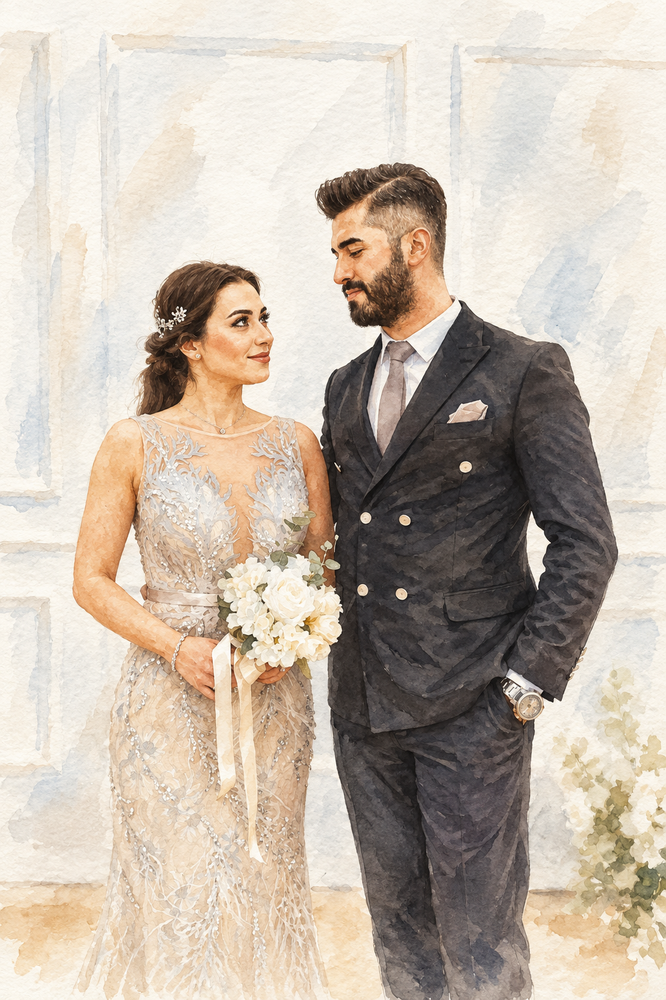
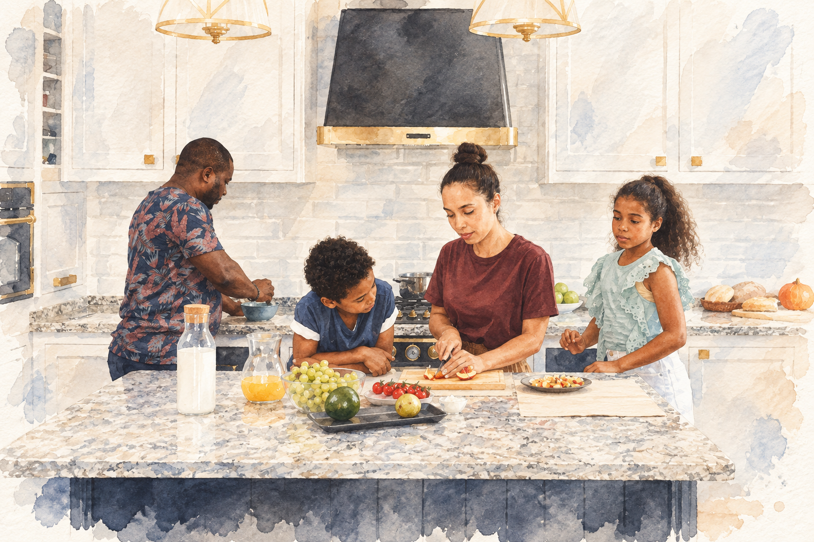

# 扩展效果实测 · 同图多风格与生活成品

[返回项目](../../README.md) · [扩展方式说明](../../extensions/style-lab/README.md) · [摄影来源](../../assets/real-inputs/README.md)

五个输出任务，六次实际内置 imagegen 调用。微缩首轮错误地生成上下双联，一次针对性重试后得到纯设计图；四个本地扩展任务各生成一次。所有实际 PNG 原样保存。目标尺寸均达成，但摄影和水彩的严格内容保留仅部分达成，未验证人脸身份一致性。

| 输出 | 性质 | 实际尺寸 | 提示词与结果 |
| --- | --- | --- | --- |
| 自然摄影 | 本地扩展 | 1024×1536 | [提示词](prompts/photo.txt) · [PNG](../../assets/generated/20260910-style-extensions-03/photo-1024x1536.png) · [记录](photo.json) |
| 水彩／保留原构图 | 本地扩展 | 1024×1536 | [提示词](prompts/watercolor.txt) · [PNG](../../assets/generated/20260910-style-extensions-03/watercolor-1024x1536.png) · [记录](watercolor.json) |
| 微缩／纯设计图 | 原库风格基准 | 1024×1536 | [首轮提示词](prompts/miniature.txt) · [首轮模式失败 PNG](../../assets/generated/20260910-style-extensions-03/miniature-1024x1536.png) · [重试提示词](prompts/miniature-retry.txt) · [采用的 PNG](../../assets/generated/20260910-style-extensions-03/miniature-retry-1024x1536.png) · [两轮记录](miniature.json) |
| 水彩／允许重新构图 | 本地扩展 | 1024×1536 | [提示词](prompts/watercolor-free.txt) · [PNG](../../assets/generated/20260910-style-extensions-03/watercolor-free-1024x1536.png) · [记录](watercolor-free.json) |
| 家庭系列水彩 | 本地扩展，双参考 | 1536×1024 | [提示词](prompts/family-series.txt) · [PNG](../../assets/generated/20260910-style-extensions-03/family-series-1536x1024.png) · [记录](family-series.json) |

## 从效果看扩展

与微缩模型不同，水彩版保持平面的纸上绘画语言。墙面、礼服、对望关系仍可辨，花型、手部与框景有变化。这说明审美模块可以扩展，但内容保留规则并不保证逐项达成。

家庭图的内容来自 Vanessa Loring 的真实厨房照片，第二张参考仅提供婚礼水彩的画法。没有把婚礼礼服、花束或人物搬入厨房。两张摄影来自不同作品、不同人物，不是同一家庭的前后故事；只有一次参考实验，没有无参考对照。

## 交互演示

本地 `http://127.0.0.1:8028/extensions.html` 提供三种风格切换、两种水彩保留程度并排对照、跨场景系列说明、三种生活成品版式和可编辑标题。切换展示既有图片，不实时生图。

相册对页直接使用原始 JPEG，文件哈希与原摄影一致；网页缩放显示不代表像素原尺寸展示。标题由 HTML 准确排版。打印按钮提供 A4 网页打印样式，不是完成印前校准的 PDF 或已验证印刷实物。

## 原库与本地扩展的边界

微缩基准保持固定提交 `3194d43ba95edbad0082b3604959e45067f72b7e` 的原始审美正文不变，追加原库的画布、纯设计与无文字块。摄影和水彩更换为本地审美配置，仍使用原库原文交付块；因此可以称作基于其结构的扩展，不能称为原版 Skill 直接具备这些风格。

所有来源、提示词和输出都有哈希，六次实际调用字符串与保存文件逐一核对。原库 vendor 快照未改动。生成不涉及本地裁切、重绘、拼版或尺寸修补；页面布局使用真实图片文件与 CSS。

## 检查范围

已逐张检查所有返回图像，记录模式、人物关系与新增内容；文件头验证六张 PNG 尺寸。浏览器中验证风格切换、版式切换及准确标题更新，并目视检查桌面页面。未做自动人脸识别、OCR、印刷校准、跨样本稳定性或费用评测。全部结果属于效果探索，不能从单张美观结果推导稳定成功率。

原始摄影许可见来源说明；原库 PolyForm Noncommercial 许可证继续保留。页面仅本地预览，未部署。
