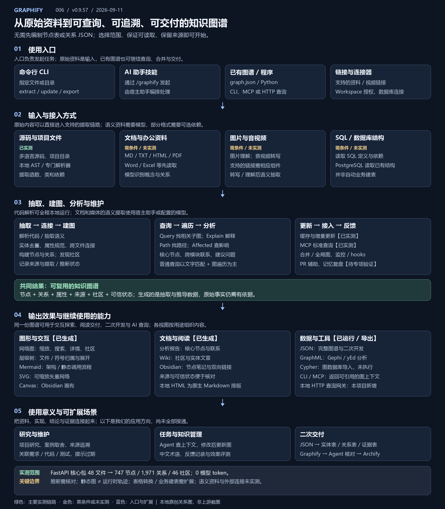

# 006 · Graphify

> **支持将源码、文档、PDF、Word/Excel、图片、音视频及 SQL 结构提取为可查询知识图谱；代码本地解析，语义资料需模型。输出交互网络、层级树、调用流程、SVG/Canvas、报告/Wiki，以及 JSON、GraphML、Cypher，辅助研究、依赖追踪与证据交付。** 本项目保留真实运行结果，逐项说明实测与未验证范围。

[在线能力与原生演示](https://yydshly.github.io/0911_codex_project/009-graphify/) · [返回总索引](../../README.md#项目索引) · [完整理解](understanding.md) · [能力与原生演示](app/dist/index.html) · [研究笔记](notes.md) · [完整图](app/dist/native/fastapi/graph.json) · [生成凭证](app/dist/native/fastapi/receipt.json)

## 一张图理解完整链路



[打开可缩放 SVG](assets/understanding-map.svg) · [下载 PNG](assets/understanding-map.png) · [阅读完整说明](understanding.md) · [网页图文入口](app/dist/index.html#understanding)

这是一张本地原创能力关系图，非上游截图。它区分上游能力、实测范围和建议扩展；真实 FastAPI 图谱在下方保留。

- **输入：** 支持格式的原始资料可直接进入提取链路，无需预先编制节点表或关系 JSON；语义资料需要模型，部分格式需要可选组件或授权。
- **处理：** 提取与去重、建图与社区分析、搜索与图遍历、节点解释、路径和修改影响；另有增量、全局图及协作能力。
- **输出：** 交互网络、树、调用流程、SVG、Canvas，报告与 Wiki，以及可复用的 JSON、GraphML、Cypher 和 CLI / MCP 查询结果。
- **建表边界：** SQL 能力主要理解已有数据库结构。实体表、关系表、来源表可由 JSON 增加转换规则生成；自动业务建模、建 SQL 表与数据清洗需要另接流程，尚未实现。
- **使用意义：** 连接研究资料、源码、结论和证据；可扩展中文术语、测试关联、过期提醒、Agent 上下文及 Graphify → Agent → Archify 交付。

## 原库能力与技术原理

代码通过 tree-sitter / AST 提取类、函数、导入、调用与继承；资料可经助手或模型抽取实体和语义关系。上游合并、去重，构建 NetworkX 图，再进行社区发现、核心节点与跨模块联系分析。查询返回带来源的相关子图，也支持节点解释、有向路径、潜在修改影响与 MCP 工具访问。

可视化只是输出之一，还能生成树形结构、调用流程、报告、Wiki、Obsidian 笔记、SVG、GraphML、Cypher、Canvas 与 JSON。适用于陌生项目阅读、重构依赖检查、资料关联和为 Agent 提供上下文。静态关系不是运行时轨迹，推断也不是已确认的业务事实。

## 本次真实演示

分析输入为 FastAPI `fastapi/` 核心包的 **全部 48 个 Python 文件**，没有扫描测试、教程或外部依赖实现。原生网络保留全部 **747 个节点、1,971 条关系、46 个社区**；1,734 条标为 EXTRACTED，237 条标为 INFERRED。模型输入、输出均为 0 token；本次社区分析使用 Louvain 回退。


这是本次实际生成的原生 SVG，非浏览器截图。[配图说明](assets/README.md)。

| 已执行能力 | 可核对的结果 |
| --- | --- |
| 原生交互网络 | [graph.html](app/dist/native/fastapi/graph.html)，全部节点和关系；另存[未改动上游 HTML](app/dist/native/fastapi/graph.upstream.html) |
| 原生层级与调用流程 | [层级树](app/dist/native/fastapi/tree.html)、[调用流程](app/dist/native/fastapi/callflow.html)；树按有来源的文件/符号组织，不等同网络节点一一映射 |
| 图分析与文档 | [报告](app/dist/native/fastapi/report.html)、[原始 Markdown](app/dist/native/fastapi/GRAPH_REPORT.md)、[Wiki](app/dist/native/fastapi/wiki/index.html)；HTML 仅增加阅读排版 |
| Query / Explain / Path / Affected | [完整查询记录](app/dist/native/fastapi/queries.json)；本地服务可输入新问题实际调用上游 CLI |
| MCP | [标准协议实测记录](app/dist/native/fastapi/integration.html)，完成初始化、工具枚举及 graph_stats / query_graph 调用 |
| 增量更新 | 同一记录中保留隔离五文件样例更新前后图；18 → 19 节点、40 → 42 关系，新增函数及调用边，原节点保留 |
| 完整导出 | 演示页提供 SVG、GraphML、Cypher、Obsidian Vault、Canvas、JSON、源文件 ZIP 和哈希清单 |

“全量”指所选 48 文件范围的全部建图结果与上述导出，不代表整个 FastAPI 仓库，也不代表上游所有集成都已执行。网络图不抽样、不聚合；原生各视图根据用途组织内容。Query 保留原生相关子图算法，预算设为 100000；Explain 原生最多详细列出 20 个连接，其余按类型汇总；Affected 默认两跳。完整关系以图谱和 JSON 为准。

文档/PDF/图片/音视频语义提取、数据库连接、跨项目全局图、Git hooks、PR 工作流、记忆复盘和 Agent 长期收益尚未实测，页面逐项标注。仅生成 Cypher，没有执行数据库写入。

## 为什么现在与 README 更一致

主演示直接使用上游 `graph.html`、树和调用流程导出器，保持其界面与交互；只将脚本依赖改成本地固定版本。README 截图与本次的输入版本、范围和力导布局可能不同，因此不应要求节点位置完全相同。

旧版五文件中文教学页面保留为[辅助教学样例](app/dist/tutorial.html)，不再代表原生效果。它的数据真实，但布局与路径交互是本地新增。

Archify 的核心是接收用户或 Agent 整理的 JSON 设计规格并画架构/流程图；Graphify 负责从资料提取关系并建图。两者可通过“提取证据 → Agent 整理 → 绘制设计图”组合，尚未接通。

## 版本与许可证

| 项目 | 固定研究输入 |
| --- | --- |
| 研究索引 / 目录 | 006 / `009-graphify` |
| 上游 | [Graphify-Labs/graphify](https://github.com/Graphify-Labs/graphify)，v0.9.57 |
| 上游提交 | `3f82bf7f837a07fb0f7668fbdbd5662801906942`，2026-09-09 |
| FastAPI 输入 | [fastapi/fastapi](https://github.com/fastapi/fastapi/tree/50113da16fec53b66b80d75e80a89296de4fa5a5/fastapi)，提交 `50113da16fec53b66b80d75e80a89296de4fa5a5` |
| Graphify 许可证 | [Apache-2.0](upstream-licenses/LICENSE)、[历史 MIT](upstream-licenses/LICENSE-MIT)、[NOTICE](upstream-licenses/NOTICE) |
| 输入与查看器许可证 | [FastAPI MIT](app/dist/native/fastapi/LICENSE-FastAPI)；[查看器版本和校验清单](app/dist/native/vendor/manifest.json)，许可证随文件保留 |
| 发布状态 | 已发布并完成线上核对；[在线演示](https://yydshly.github.io/0911_codex_project/009-graphify/)，实时 CLI 查询需本地服务 |

## 运行与复现

在本项目目录建立 Python 3.12 环境，安装固定锁文件：

```powershell
uv venv .venv --python 3.12
uv pip install --python .venv/Scripts/python.exe -r app/requirements-native.lock
.venv/Scripts/python.exe app/server.py --port 8769
```

打开 <http://127.0.0.1:8769/>，原生查看器和实际 CLI 查询均可使用。只需要浏览已生成产物时，可用普通静态服务器；Pages 上保留原生交互和真实查询记录，实时查询按钮会说明需本地服务。

重新生成需准备 FastAPI 仓库并检出表中固定提交，再执行：

```powershell
.venv/Scripts/python.exe app/generate_native.py --source <FastAPI仓库路径>
.venv/Scripts/python.exe app/verify_integrations.py
node app/check-native.cjs
node app/check.cjs
```

生成脚本验证 FastAPI 提交，运行提取、所有导出与查询；MCP 和增量验证在临时目录执行。锁文件记录 Windows / Python 3.12 环境，其他平台需调整平台专用依赖并验证。旧教学样例可通过 `app/generate.py` 复现。

理解文档、网页说明与总览图由 `app/build_understanding.py` 统一生成；使用本项目环境运行，依赖 Pillow 和 Windows 微软雅黑字体。

检查覆盖网络与 JSON 全量一致、来源哈希、依赖完整性、脚本语法、导出文件及真实集成记录；教学样例另有路径和影响分析对照。根目录 `node scripts/build-pages.cjs` 合并站点。尚未进行浏览器交互和截图验收。

## 对我们的意义与扩展

可先用于本研究仓库的源码导航和重构检查，再关联已精读文章中的问题、约束、方案与证据。面向持续执行任务，可把相关实现和约束作为 Agent 上下文，但节省成本与提高成功率需独立评测。

本地值得扩展的是中文术语统一、结论过期提醒、代码与测试/业务需求关联，以及用编译器或运行时证据校验静态关系。上游已有的增量更新、全局图和 MCP 应直接集成，不重复计为原创能力。

## 部署验证

2026-09-11 发布提交 `18cdac156fb85d1b5e8e89e8a75b08c445ec3e9c` 的 [Pages 工作流](https://github.com/yydshly/0911_codex_project/actions/runs/34502181725)成功。37 个线上文件返回 200，涵盖总入口、六种原生结果、总览图、主要下载及已有子站；文本按 LF 归一后与构建一致，PNG/ZIP 按原始字节一致。[完整验证记录](deployment-verification.json)。线上提供原生交互与真实查询记录，实时 CLI 查询在本地服务执行；未进行浏览器交互验收。
