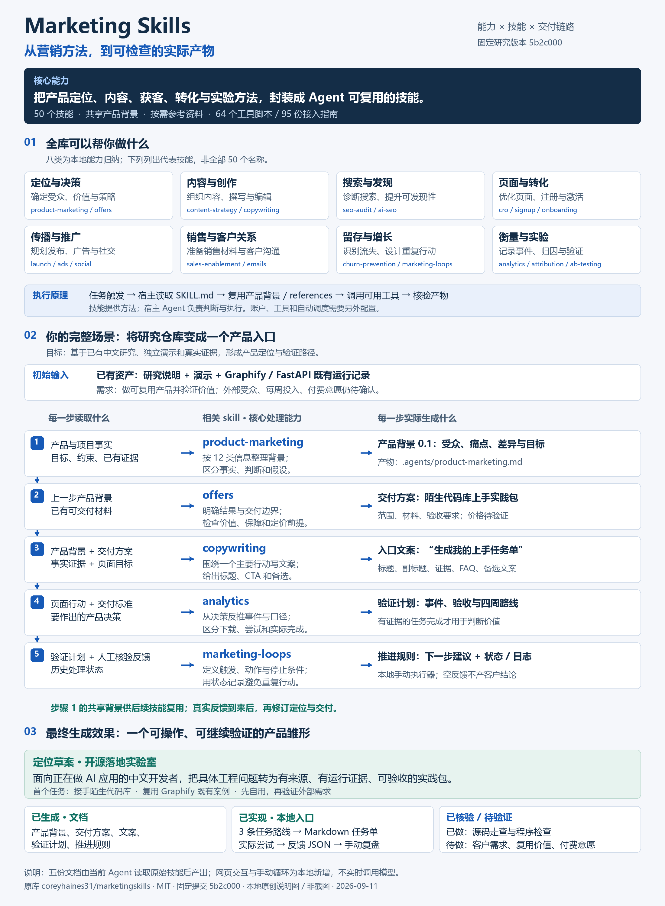

# 007 · Marketing Skills

> **Marketing Skills 是供 Agent 使用的营销方法库。** 固定版本的 50 个技能覆盖定位与决策、内容创作、搜索发现、页面转化、推广、销售与客户关系、留存增长及衡量实验。它把输入要求、分析步骤、参考框架和交付要求写入技能，由宿主 Agent 结合产品背景、真实资料与可用工具执行，产出研究、方案、文案和验证计划。适合独立开发者、创始人与小团队；账户连接、对外操作和业务效果需要分别配置与验证。

[范围与能力摘要](scope.md) · [完整输入输出说明图](assets/capabilities-flow.png)

[返回总索引](../../README.md#项目索引) · [打开中文展示页](app/dist/index.html) · [真实技能应用与产品定位](app/dist/real-case.html) · [50 技能与工具中文手册](catalog.md) · [研究笔记](notes.md) · [上游仓库](https://github.com/coreyhaines31/marketingskills) · [源码清单](sources/inventory.json)

## 项目信息

| 项目 | 内容 |
| :--- | :--- |
| 研究索引 | 007；按原库计数 |
| 历史目录 | `010-marketingskills`；与研究索引分别维护 |
| 上游 | [coreyhaines31/marketingskills](https://github.com/coreyhaines31/marketingskills) |
| 固定提交 | `5b2c0007766c6a1cf1d53fd8fc73e979e0821022`；提交日期 2026-09-04（上游时区 -0700） |
| 插件版本 | 2.11.1；每个技能另外维护自身版本 |
| 研究日期 | 2026-09-10 |
| 源码规模 | 50 个技能、64 个 JavaScript 工具脚本、95 份集成指南；按固定提交实际目录统计 |
| 技术栈 | 上游：Markdown / YAML 技能、Node.js 工具；本地展示：原生 HTML / CSS / JavaScript |
| 许可证 | 上游 [MIT 原文副本](sources/LICENSE)，Copyright (c) 2025 Corey Haines |
| 研究状态 | 研究中：代表性源码与机制已分析；没有接入真实营销账户或复现全部技能 |
| 展示状态 | 中文静态展示已完成；支持离线打开与本地预览，尚未部署 |
| 发布方式 | 已合并 GitHub Pages 部署清单，统一打包时保留其他项目产物 |

## 本地新增展示

1. **50 个技能详情**：按八类用途组织，每项说明适用任务、输入、方法、产物、验收提示与协作建议，附版本、源码行号和参考资料入口。
2. **六个任务讲解**：研究手册入口、产品发布、注册优化、内容增长、留存改进和持续复盘；每个场景六步，可任意跳转或逐步查看。
3. **执行职责与产物**：每步说明执行者、相关技能、读取或输出位置、示例产物与能力边界。
4. **技术原理**：任务触发、按需加载、产品背景共享、工具接入、结果反馈，以及长流程的文件续接约定。
5. **完整工具目录**：95 份指南的上游接入标记，以及 64 个脚本、环境变量名称和静态预览分支检测结果。
6. **上手与工程手册**：安装方式、固定版本、迁移注意事项、任务输入、文件职责、循环状态与停止条件。
7. **选型与衡量**：相邻技能的分工、AARRR 阶段的证据、常见术语、成本、实践路线和失败排查。
8. **证据与扩展方向**：区分源码归纳、本地建议、离线测试和仍待验证的真实业务效果；提供可下载 Markdown 手册。

网页、中文分类、讲解脚本及流程图均为本地新增。主手册的六个教学场景文字预先编写，不是真实执行记录。八类是本地教学分类，不是上游唯一分类标准。

## 真实技能应用：从当前研究仓库到产品定位

[打开完整场景](app/dist/real-case.html) · [应用过程与全部产物](runs/product-positioning/README.md) · [产品背景草案](runs/product-positioning/.agents/product-marketing.md)

本次 Agent 读取固定版本五份原始技能，按顺序应用 product-marketing → offers → copywriting → analytics → marketing-loops，复用当前研究索引和 Graphify 既有 FastAPI 运行记录，产出共享背景、交付方案、页面文案、验证计划与推进规则。原文、输入、输出和哈希清单均保留。

建议产品方向为“开源落地实验室”：面向正在做 AI 应用的中文开发者，将具体工程问题转为有证据、可验收的开源实践包。首个入口聚焦“陌生代码库上手”，已实现三条任务路线、Markdown 任务单导出、实际尝试后的反馈 JSON 导出，以及有状态的手动推进循环。页面不实时调用模型；文档工作由当前 Agent 实际完成，交互和循环脚本为本地新增。

当前定位仍为草案；外部用户、需求与付费意愿尚未验证。没有重新运行 Graphify、发送内容、接入营销账户或创建定时任务。空反馈的基线和重复检查已真实执行，业务结果没有伪造。页面已本地可用，尚未部署或做浏览器视觉验收。

## 整体原理图



2026-09-11 新增一张完整说明图：核心能力 → 八类代表技能 → 当前研究的五步真实应用 → 每步产物 → 最终效果。区分原库方法、本地生成物与待验证业务效果。原创说明图，非软件截图。[高清 PNG](assets/capabilities-flow.png) · [可缩放 SVG](assets/capabilities-flow.svg) · [早期执行机制图](assets/guide.svg) · [配图说明](assets/README.md)

## 能力边界

- 框架和模板可减少遗漏，但没有证明它能稳定提高任何项目的流量或转化率。
- 工具注册表列出接入方式，不代表账户已经连接、脚本已经全部安装或接口仍全部兼容。
- 共用产品背景需要维护；不会自动完成用户研究或保证事实最新。
- 营销计划有阶段和进度文件约定；仓库没有为所有技能提供独立、强制的调度及验收服务。
- 多视角决策技能是基于公开框架的观点模拟，不是真实专家参与或背书。

## 运行与验证

展示无第三方运行依赖，不需要安装上游技能或提供 API 密钥。可以直接用浏览器打开 [app/dist/index.html](app/dist/index.html)。使用 Node.js 18+ 时，从本子项目目录运行：

```powershell
node app/scripts/check.cjs
node app/scripts/check-interactions.cjs
node app/scripts/check-upstream-preview.cjs
node app/scripts/check-real-case.cjs
node app/scripts/preview.cjs
```

前四项分别检查内容与静态资源、教学场景交互、上游 GA4 离线预览路径、真实应用的哈希与导出交互及推进循环。最后一项在 `http://127.0.0.1:4317` 启动预览，可在命令末尾指定其他端口。离线脚本测试不调用真实服务。

修改本场景文档后运行 `node app/scripts/build-real-case.cjs` 同步网页数据和下载文件。使用已保存快照构建，无需上游检出或网络。只有明确更新输入快照时，才在该命令后传入固定提交的上游检出目录；它会重新复制输入与原始技能。手动处理真实反馈的命令为 `node app/scripts/run-product-loop.cjs`，详见场景说明。构建不会重跑反馈循环。

修改 `app/handbook.html`、技能阅读卡或工具证据后，先运行 `node app/scripts/build-handbook.cjs`，同步静态网页片段与 [catalog.md](catalog.md)。构建脚本只从本地源生成内容，无需网络或上游检出目录。

从仓库根目录运行 `node scripts/build-pages.cjs` 可将清单内所有展示汇总到 `_site/`。构建不表示发布成功；在线链接仅在部署完成并实际验证后填写。

### 更新快照与配图

取得固定上游提交的独立检出目录后，运行 `node app/scripts/snapshot.cjs '<上游独立检出目录的绝对路径>'`。脚本核对提交，提取名称与版本、计算每个技能的 SHA-256，并生成清单、页面元数据和 MIT 副本。变更研究版本时须同时更新来源链接、文档及校验要求。

使用 `node app/scripts/build-evidence.cjs '<上游独立检出目录的绝对路径>'` 生成技能节标题、行号、参考链接、95 项工具登记与 64 项脚本信息，并复制固定版本 GA4 脚本供阻断网络的测试使用。证据保存于 [sources/evidence.json](sources/evidence.json)。

原理图重建使用 `python assets/build-guide.py`，额外需要 Pillow 和中文字体；已有 PNG / SVG 为成品，日常浏览和检查不需要 Python。

## 来源与改动

研究固定于 [上游提交](https://github.com/coreyhaines31/marketingskills/tree/5b2c0007766c6a1cf1d53fd8fc73e979e0821022)。本地保存提取的元数据、源码证据及 MIT 许可证，并原样复制一个 GA4 脚本供离线预览测试；没有安装技能或接入真实业务工具。来源与复制范围见 [sources/README.md](sources/README.md)，研究结论见[研究笔记](notes.md)，检查结果见 [verification.json](verification.json)。

后续工作：校正定位背景、完成维护者真实任务验收与外部需求验证，以及线上发布和浏览器验收。
