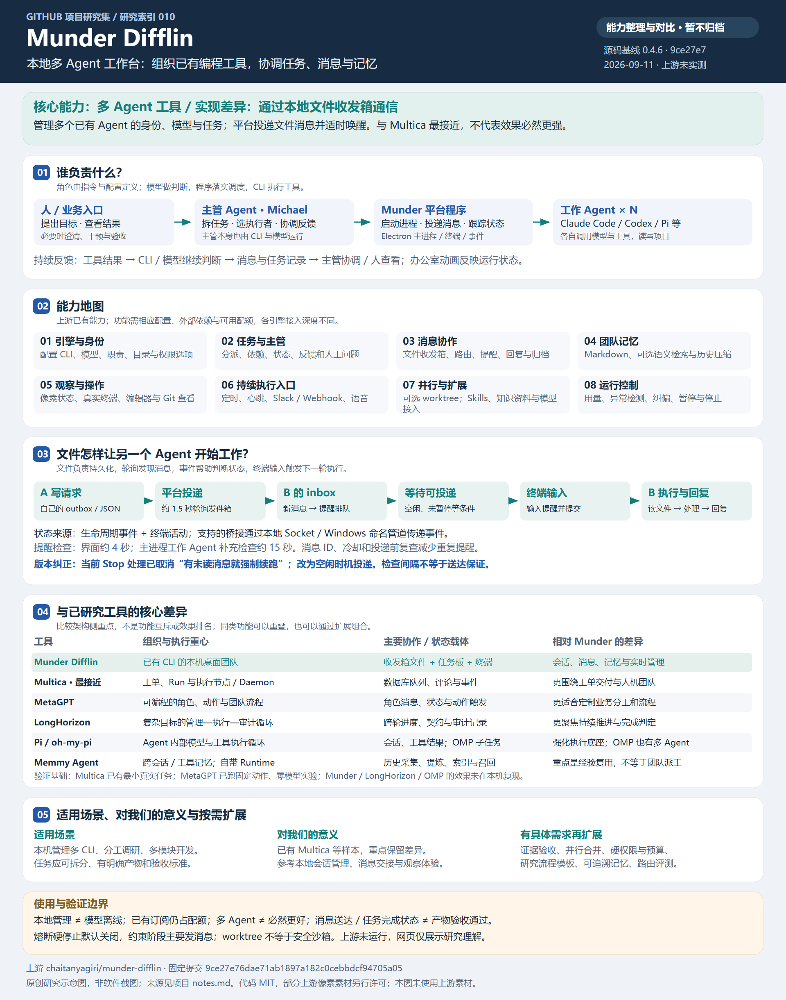

# 010 · Munder Difflin

> **Munder Difflin 是一个多 Agent 工具：管理多个已有编程 Agent 的模型、身份、任务与运行状态。我们关注的核心实现差异是使用本地文件收发箱实现 Agent 间的协作通信，由平台轮询投递、判断状态并在空闲时通过终端输入唤醒处理。**

[返回总索引](../../README.md#项目索引) · [简要研究记录](notes.md) · [上游仓库](https://github.com/chaitanyagiri/munder-difflin)

[在线阅读：多 Agent 与文件通信](https://yydshly.github.io/0911_codex_project/011-munder-difflin/) · [部署验证记录](deployment-verification.json)

## 一图总览



原创研究示意图，非软件截图。覆盖我们已形成的能力、原理、对比、意义与按需扩展结论；不代表上游运行效果已验证。

[查看高清 PNG](assets/overview.png) · [放大矢量图](assets/overview.svg) · [配图与来源说明](assets/README.md)

## 能力概览

| 能力 | 解决的问题 |
| --- | --- |
| 多引擎与角色管理 | 启动 Claude Code、Codex、Pi 等已有 CLI，为执行者配置职责、模型、工作目录与运行选项；各引擎支持深度不同 |
| 主管与任务管理 | 主管 Agent 接收目标、分派工作、协调反馈；任务板记录负责人、依赖、状态与人工问题 |
| Agent 消息交接 | 用各自的文件收发箱交换请求和结果，平台负责路由、提醒与运行状态管理 |
| 长期记忆 | 保存 Markdown 经验，支持可选 MemPalace 语义检索及记忆压缩；不等于训练模型 |
| 实时观察与介入 | 像素办公室展示状态，真实终端支持查看输出、输入指令以及暂停、纠偏和停止 |
| 并行工作与持续运行 | 支持可选 Git worktree 隔离、定时任务、心跳及 Slack/Webhook 入口 |
| 运行监控 | 记录用量与成本信号，检测重复调用、连续错误和缺少进展等情况，并按配置干预 |

以上为上游说明与部分源码核对结果；本次没有安装应用、连接账户或实测协作效果。引擎适配不完全一致，任务完成状态也不等于产物验收通过。

## 原理保留到这一层即可

它与 Multica 等工具都能组织多个 Agent；本次保留的辨识点是**通信通过文件实现**。每个 Agent 拥有自己的 `outbox/` 和 `inbox/`，平台统一投递；不是模型直接共享上下文，也不是文件变化后模型自动开始思考。这是实现差异，不意味着其他工具不能使用文件或它的效果必然更好。

**模型提供判断 → CLI 执行工具 → Munder 管理多个 CLI 与协作。**

消息交接使用“文件收发箱 → 定时路由 → 新消息提醒排队 → 合适的空闲时机向终端提交提醒 → Agent 读取并处理文件 → 回复和归档”。生命周期事件帮助判断状态。文件承载消息，程序负责调度，Agent 负责理解与执行；文件通信是实现选择，不是多 Agent 独有能力。

当前固定版本的 Stop 事件处理已经取消因未读消息而强制续跑的旧路径，采用空闲时机投递输入；不能照抄早期设计文档中的 Stop-hook 强制继续说明。具体源码入口见[研究记录](notes.md)。

## 与已有研究的关系

| 对照对象 | 保留的差异 |
| --- | --- |
| Multica | 最接近：都组织已有 Agent 工具。Multica 以工单、Run 和执行节点为中心；Munder 更侧重本机终端会话、文件式协作、团队记忆和桌面管理体验 |
| MetaGPT | 提供可编程的角色、动作、消息和团队流程；Munder 主要包装已有 CLI 执行者 |
| [LongHorizon](../003-longhorizon-harness/README.md) | 更关注原始目标、跨轮进度和管理—执行—审计循环；Munder 的主管与任务板不能直接视为同一验收制度 |
| [oh-my-pi](../004-oh-my-pi/README.md) | 加强 Agent 内部的工具执行与子 Agent 协作；Munder 在多个既有 CLI 外层组织团队 |
| Memmy | 更关注跨会话、跨工具的经验采集和召回；共享记忆与当前任务调度职责不同 |

这些是架构侧重点，不是能力互斥或性能排名。

## 使用场景与后续取舍

可用于本机管理多个编程 Agent、分工调研或多模块开发，以及观察消息和终端运行过程。需要明确的交付标准、可用的 CLI、模型配额和执行环境。

**当前为研究中：能力、对比总览和中文网页已整理，暂不归档，后期按需深入。** 网页展示我们的理解和说明图，不提供上游在线执行服务；未继续安装上游、横向评测或实现扩展。仅在出现以下具体需求时重新评估：

- 需要本机多 CLI 的统一终端和桌面管理体验。
- 需要借鉴文件消息交接、空闲投递或团队记忆设计。
- 现有方案出现明确缺口，且能用同一任务验证 Munder 的新增收益。

## 项目信息与边界

| 项目 | 内容 |
| --- | --- |
| 研究索引 / 存储目录 | 010 / `011-munder-difflin` |
| 研究版本 | package.json 声明 0.4.6；提交 [`9ce27e76dae71ab1897a182c0cebbdcf94705a05`](https://github.com/chaitanyagiri/munder-difflin/tree/9ce27e76dae71ab1897a182c0cebbdcf94705a05) |
| 记录日期 | 2026-09-10；2026-09-11 整理网页 |
| 技术栈 | Electron、React、TypeScript、Pixi.js、xterm.js、node-pty |
| 许可证 | [代码 MIT](https://github.com/chaitanyagiri/munder-difflin/blob/9ce27e76dae71ab1897a182c0cebbdcf94705a05/LICENSE)；[部分像素素材单独许可](https://github.com/chaitanyagiri/munder-difflin/blob/9ce27e76dae71ab1897a182c0cebbdcf94705a05/LICENSE-ASSETS) |
| 研究状态 | 研究中（能力与对比图已整理，暂不归档；上游运行未实测） |
| 截图 / 演示 | 原创总览图与静态研究页；暂无上游真实截图或 Agent 运行演示 |
| 本地新增 | 中文能力说明、研究记录、总览图和文件交互步骤讲解；未引入上游程序或素材 |

本地运行不等于模型请求完全离线，复用订阅仍占用相应配额。运行保护依赖配置和引擎能力：固定版本的熔断强制停止默认关闭，约束阶段主要通过消息要求调整行为，不能视为默认硬性权限或预算封锁。

## 网页构建与验证

研究页源于本说明和 `notes.md`，保留总览图、完整对比与来源，并以六步交互讲解文件通信。步骤是教学说明，不启动 Agent 或调用模型。

从仓库根目录依次执行：

```text
python -m pip install -r projects/011-munder-difflin/app/requirements.txt
python projects/011-munder-difflin/app/build.py
node projects/011-munder-difflin/app/check.cjs
node scripts/build-pages.cjs
```

发布遵循[统一 GitHub Pages 约定](../../docs/web-demos.md)，子路径固定为 `011-munder-difflin/`，合并发布清单以保留其他站点。


## 发布记录

2026-09-11 已通过 GitHub Pages 发布并验证。首次发布提交 `21f6bac31d06ff70ea5a4b152718577f8a94c017`，[发布流程成功](https://github.com/yydshly/0911_codex_project/actions/runs/34500138183)。19 个线上文件核对通过，覆盖新页全部资源、总入口、已有子站入口及预览图；文本按 LF 归一、PNG 按原始字节比较。上游 Agent 未运行，项目暂不归档。
