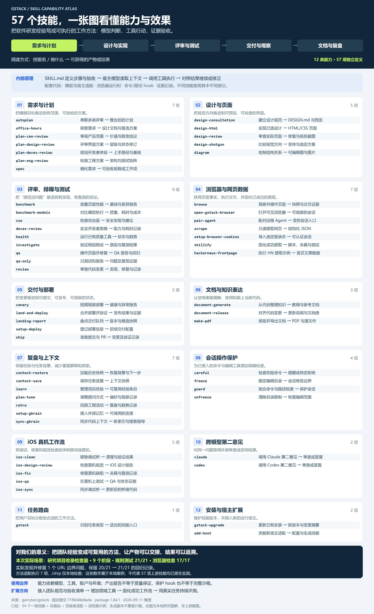
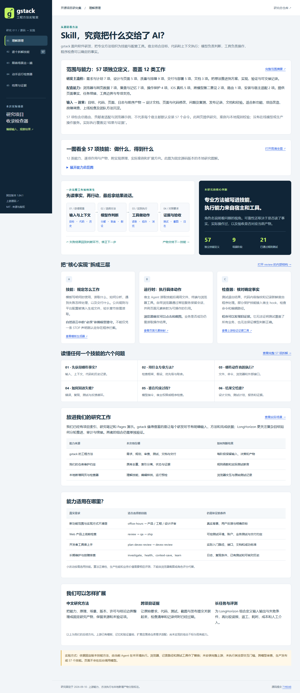

# 011 · gstack：工程方法、技能原理与场景实践

gstack 是面向软件研发的 Agent 技能与配套工具库。本次固定版本有 57 项独立定义、12 类能力：需求与计划、设计与页面、质量与排障、浏览器与网页数据、交付、文档、记忆、操作保护、iOS 真机、跨模型协作、任务路由及安装适配。宿主结合项目上下文、模型判断和可用工具执行技能，产出方案、页面与代码修改、测试证据、交付记录和可复用经验。

[返回总索引](../../README.md#项目索引) · [范围与能力摘要](scope.md) · [核心研究](research.md) · [57 个技能完整解读](skills.md) · [实验记录](notes.md) · [在线网页](https://yydshly.github.io/0911_codex_project/012-gstack/)

## 项目信息

| 项目 | 内容 |
| --- | --- |
| 研究索引 / 历史目录 | 011 / `012-gstack`；按原库去重，编号分别维护 |
| 上游 | [garrytan/gstack](https://github.com/garrytan/gstack) |
| 固定研究提交 | `71f6048e8ada25180e61438abc1d98cb151fe9a7` |
| 版本 | package.json 为 1.84.1；提交信息为 v1.84.1.0 |
| 研究日期 | 2026-09-10 |
| 上游许可证 | MIT，Copyright © 2026 Garry Tan；[保留的许可原文](UPSTREAM-LICENSE.txt) |
| 本地实现 | 中文静态网页、JavaScript 校验函数、Node 测试；无第三方前端依赖 |
| 研究状态 | 源码与方法研究完成，实际方法实践及本地工具已验证；全量原生上游运行未复现 |
| 发布状态 | [已部署并验证](https://yydshly.github.io/0911_codex_project/012-gstack/)；GitHub Pages 统一发布 |

## 原库能力与本地新增

**原库已有**：专业技能与跨环节交接、真实浏览器工具、模板生成与多宿主适配、独立审查路径、会话保护、代码和验证证据记录、文档与记忆辅助。各技能依赖和执行边界不同，不保证全部宿主等价。

**本地新增**：五个网页视图，覆盖核心理解、57 项技能详情、九阶段场景实录、可操作收录检查器和实际证据。每个技能均有输入、执行方法、模型判断、工具动作、完成检查、产物、边界、固定源码与配套章节。

**目录口径**：54 个一级目录技能 + 1 个总路由 + 1 个贡献者技能 + 1 个 browser-skill 示例。平台生成副本、OpenClaw 方法副本和测试夹具不重复计入。共保存 103 份模板或章节的来源与指纹。

## 实际场景与效果

目标是研究项目收录检查器。将仓库原库去重、研究索引与目录分离、图片性质与发布声明证据等规则转成可解释的本地预检。五组样例均为明确标注的教学输入，函数执行与测试是真实结果。

流程：需求探索 → 产品范围 → 工程计划 → 设计检查 → 当前 Agent 实现 → 审查 → 浏览器 QA → 文档同步 → 本地交付检查。

- 规则测试 **21/21** 通过；源码审查实际发现 1 项边界缺陷，保留 **20/21 → 21/21** 的失败与修复证据。
- 浏览器检查 **17/17** 通过，覆盖技能详情、搜索筛选、场景导航、编辑和结果、错误恢复、窄屏、放大与键盘操作。
- 检查器在浏览器内运行，不上传输入、不访问远程网页、不修改仓库。规则通过不代表研究完成或远程部署已经验证。

实验采用固定版本技能方法，由当前 Agent 执行并替换浏览器和记录工具；**不是完整上游安装后的原生技能运行**。未执行所有问答门槛、独立或跨模型审查、上游保护 hook、iOS、GBrain、原生推送/PR/生产发布，未测量上游整体成功率。

## 一张图看懂技能能力与效果



按 12 类逐项说明“做什么 → 得到什么”，附研发流程、实现原理、本地实测效果和扩展方向。[高清 PNG](assets/skills-capability-map.png) · [矢量 SVG](assets/skills-capability-map.svg)。这是基于固定上游版本制作的研究图解，不是上游界面截图；全部 57 项已与技能目录核对。

## 真实界面



本地新增网页的实际 Chromium 截图，非上游界面、AI 生成图或虚构执行轨迹。另见[图片说明](assets/README.md)与[检查器截图](assets/lab-desktop.png)。

## 运行与检查

在本目录的 `app/` 内运行：

```text
node scripts/serve.cjs
node scripts/test.cjs
node scripts/check.cjs
```

预览地址为 `http://127.0.0.1:4312/`。源码即 `app/dist/`，无需安装前端依赖。网页证据通过本地 HTTP 读取，推荐使用服务器打开。

浏览器检查需要 Playwright 与其 Chromium。可以用 `PLAYWRIGHT_MODULE` 指定已安装模块位置，再运行 `node scripts/browser-check.cjs`。本次使用宿主提供的运行时，无系统全局安装。

重新生成技能目录需要固定上游快照：`python scripts/build-catalog.py <固定版本上游目录>`。生成前核对提交；正常使用无需重新生成。发布流程检查已提交文件，避免 CI 自动刷新研究快照。

## 证据与来源

- [修复前实际测试](app/dist/evidence/tests-before.json) · [修复后实际测试](app/dist/evidence/tests.json)
- [浏览器实际检查](app/dist/evidence/browser.json) · [静态与指纹检查](app/dist/evidence/site-check.json)
- [源码清单与指纹](app/dist/evidence/source-manifest.json) · [原始审查记录](app/dist/evidence/05-review.md)
- [上游固定架构](https://github.com/garrytan/gstack/blob/71f6048e8ada25180e61438abc1d98cb151fe9a7/ARCHITECTURE.md)

复制的上游模板与章节保持原文，用于阅读与研究，保留 MIT 许可。本地网页、检查器、中文解读和方法实践记录单独编写，没有执行这些保存的模板文件。

## Web 发布与验证

2026-09-11 已发布：[在线工程方法实验室](https://yydshly.github.io/0911_codex_project/012-gstack/) · [在线高清能力图](https://yydshly.github.io/0911_codex_project/012-gstack/assets/skills-capability-map.png)。

首次发布提交 `cdccd382c43e0e16e9a7bd9cbaf3ca84909186c5` 的 [Pages 流程](https://github.com/yydshly/0911_codex_project/actions/runs/34504589047)成功。142 项线上资源核验通过：新站全部 131 个静态文件、总入口与总览图对照本地构建，9 个既有子站入口正常。CI 检查报告仅排除实际运行时间差异，总入口按换行归一比较，其余新站文件按原始字节比较。

另用真实浏览器验证线上范围摘要、57 项目录与详情、阶段文档、检查器去重和测试证据，共 5 项通过，无页面运行错误。[资源核验记录](deployment-verification.json) · [线上交互记录](deployment-browser.json)。这是本地新增研究网页的发布，未把上游 `/ship` 记作完整原生执行。
