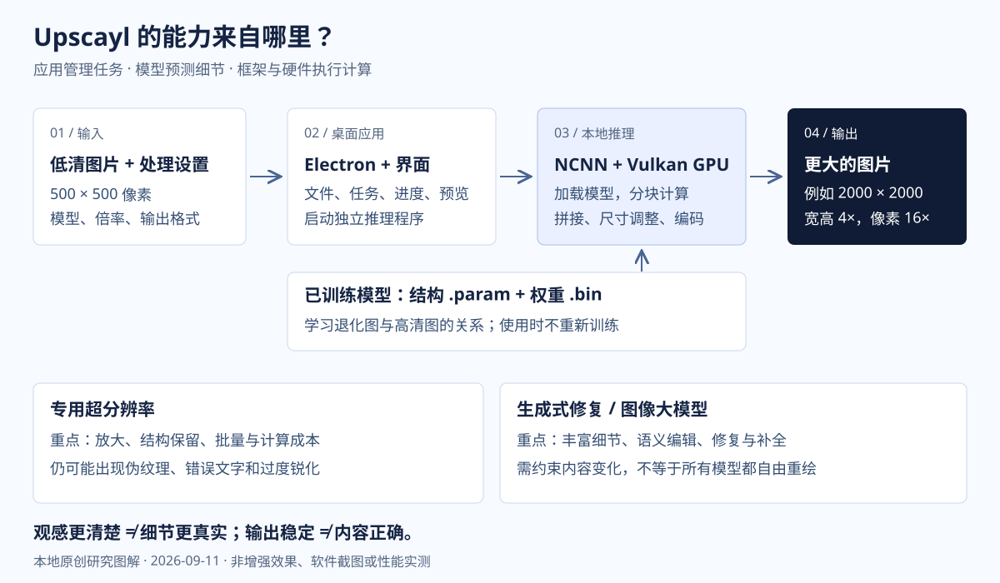

# 013 · Upscayl

> 本地图像超分辨率工具：将预训练模型、GPU 推理和批量文件处理整合为跨平台桌面应用，在尽量保留内容的前提下放大图片、改善细节观感。稳定输出与细节真实是两回事。

[返回总索引](../../README.md#项目索引) · [完整中文研究手册](notes.md) · [配图说明](assets/README.md)

## 项目信息

| 项目 | 内容 |
| :--- | :--- |
| 研究索引 | 013（历史目录 013-upscayl） |
| 上游 | [upscayl/upscayl](https://github.com/upscayl/upscayl) |
| 固定主仓库版本 | [a00d55fee90e0f9435d5eaa86e76700df8199af8](https://github.com/upscayl/upscayl/tree/a00d55fee90e0f9435d5eaa86e76700df8199af8)，配置版本 2.15.0 |
| 独立后端参考 | [0beb39028a0ddd83250e845b4c3333c0675e3b97](https://github.com/upscayl/upscayl-ncnn/tree/0beb39028a0ddd83250e845b4c3333c0675e3b97)，未核实其与打包二进制的对应关系 |
| 收录日期 | 2026-09-11 |
| 技术栈 | Electron / React / Next.js / TypeScript；C++ / NCNN / Vulkan |
| 上游许可证 | [AGPL-3.0](https://github.com/upscayl/upscayl/blob/a00d55fee90e0f9435d5eaa86e76700df8199af8/LICENSE)，模型与依赖分别核查 |
| 研究状态 | 研究中：文档与相关源码已整理；上游运行和竞品效果未实测 |
| 网页状态 | 本地已生成；尚未部署验证 |
| 发布方式 | 接入仓库统一 GitHub Pages 清单，独立子路径 013-upscayl/ |

## 我们的理解

- 核心任务是图像超分辨率，500×500 放大到 2000×2000 时宽高各 4 倍、像素总量 16 倍，但不等于信息真实性提高 16 倍。
- 模型负责预测细节；NCNN 执行网络，Vulkan 连接 GPU，Upscayl 负责应用体验与任务管理。
- 相对生成式编辑，更容易保持原图结构并稳定批量处理，但仍可能出现错误文字、伪纹理、过锐和面部偏差。
- 原貌保持、真实细节、重复结果、多图／视频连续性需要分别评价，不能互相替代。
- 同类工具的画质取决于模型及完整处理链；Upscayl 的产品化价值不等于独有算法优势。

## 本地新增的网页与文档

完整手册包含十章：能力、价值与场景、五层原理、部署、同类对比、大模型差异、一致性、选型验证、扩展方向和证据来源。正文与网页共用 [notes.md](notes.md)，配有 30 个来源入口和固定版本记录。

对比包括 Topaz Gigapixel、Adobe Camera Raw、chaiNNer，以及 Real-ESRGAN、waifu2x、SwinIR、HAT、SUPIR、Qwen-Image；区分商业产品、流程工具和底层模型，不编造性能排名或价格。

网页支持章节导航、移动端表格横向阅读、文档下载和浏览器打印。没有图片上传、在线增强、模型调用或真实效果模拟。没有执行上游推理、竞品盲测和浏览器视觉测试。

## 技术总览图



本地原创技术示意图，非上游界面截图、增强样张或性能证据。暂无真实软件截图；[打开矢量图](assets/architecture.svg)。

## 本地运行与检查

在本目录的 `app/` 内：

```text
python -m pip install -r requirements.txt
python build.py
node check.cjs
node serve.cjs
```

本地预览 `http://127.0.0.1:4313/`。Python 构建仅需固定的 Markdown 依赖，Node.js 检查与服务器均使用内置模块。无需训练或运行 Upscayl 模型。`app/dist/` 是可直接发布的完整静态输出，下载文档与主文档字节一致。

仓库统一汇总命令为 `node scripts/build-pages.cjs`；会保留全部现有站点。发布前检查相对资源、锚点、文档同步、来源定义、模板占位和脚本语法。部署状态以实际远端核对结果为准，见 [Web 约定](../../docs/web-demos.md)。

## 来源与范围

仅原创中文解读、网页和 SVG，没有引入上游权重、二进制或代码副本。主项目和后端版本分别固定；其他产品使用核对日的官方资料，未冻结其全部版本。来源与判断边界见[完整手册](notes.md)，机器可读记录见[研究清单](app/dist/research-manifest.json)。
