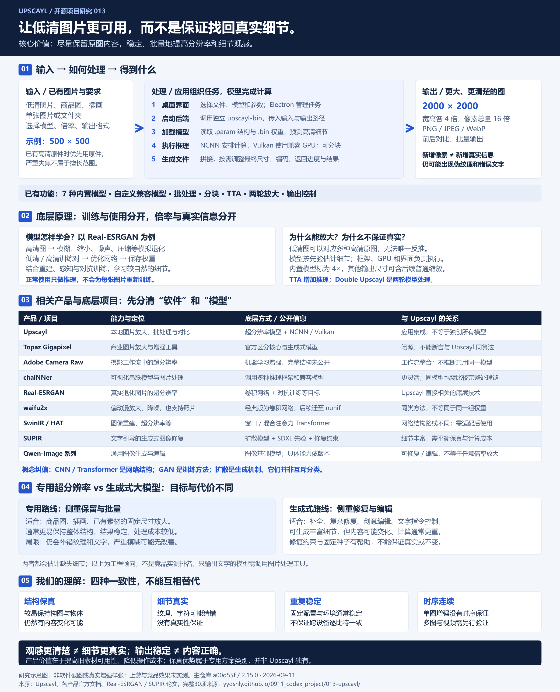

# 013 · Upscayl

> 本地图像超分辨率工具：将预训练模型、GPU 推理和批量文件处理整合为跨平台桌面应用，在尽量保留内容的前提下放大图片、改善细节观感。稳定输出与细节真实是两回事。

[在线研究手册](https://yydshly.github.io/0911_codex_project/013-upscayl/) · [返回总索引](../../README.md#项目索引) · [完整中文研究手册](notes.md) · [配图说明](assets/README.md)

## 项目信息

| 项目 | 内容 |
| :--- | :--- |
| 研究索引 | 013（历史目录 013-upscayl） |
| 上游 | [upscayl/upscayl](https://github.com/upscayl/upscayl) |
| 固定主仓库版本 | [a00d55fee90e0f9435d5eaa86e76700df8199af8](https://github.com/upscayl/upscayl/tree/a00d55fee90e0f9435d5eaa86e76700df8199af8)，配置版本 2.15.0 |
| 独立后端参考 | [0beb39028a0ddd83250e845b4c3333c0675e3b97](https://github.com/upscayl/upscayl-ncnn/tree/0beb39028a0ddd83250e845b4c3333c0675e3b97)，未核实其与打包二进制的对应关系 |
| 收录日期 | 2026-09-11 |
| 技术栈 | Electron / React / Next.js / TypeScript；C++ / NCNN / Vulkan |
| 上游许可证 | [AGPL-3.0](https://github.com/upscayl/upscayl/blob/a00d55fee90e0f9435d5eaa86e76700df8199af8/LICENSE)，模型与依赖分别核查 |
| 研究状态 | 研究中：文档与相关源码已整理；上游运行和竞品效果未实测 |
| 网页状态 | [已部署并验证](https://yydshly.github.io/0911_codex_project/013-upscayl/) |
| 发布方式 | 接入仓库统一 GitHub Pages 清单，独立子路径 013-upscayl/ |

## 摘要：能力、大模型差异与同类路线

**这个库能做什么？** Upscayl 是开源、本地运行的图片超分辨率桌面工具。输入单张图片或文件夹，选择模型、倍率与格式，输出尺寸更大、边缘与纹理观感更清楚的图片；适合商品图、插画、旧素材的放大和批量处理。它集成预训练模型，通过 NCNN 执行网络、Vulkan 调用 GPU，用户正常使用时只做推理。核心价值是降低使用模型的门槛，把本地处理、模型选择、批量输出和前后对比整合起来。严重失焦图片不在其擅长范围，新增细节也不保证真实。[上游说明](https://github.com/upscayl/upscayl/blob/a00d55fee90e0f9435d5eaa86e76700df8199af8/README.md)、[处理参数](https://github.com/upscayl/upscayl/blob/a00d55fee90e0f9435d5eaa86e76700df8199af8/electron/utils/get-arguments.ts)、[后端实现](https://github.com/upscayl/upscayl-ncnn/blob/0beb39028a0ddd83250e845b4c3333c0675e3b97/src/realesrgan.cpp)

**与大模型实现有何差异？** 这里比较的是能输出图片的生成／编辑大模型；只输出文字的模型需要调用图像工具。Upscayl 常用专用超分辨率网络，围绕原图预测高分辨率像素，通常更便于固定尺寸放大、保留整体结构和稳定批量处理。生成式图像大模型利用更广泛的图像与语义先验，擅长文字引导的修复、补全和编辑，也可能改变纹理、文字或身份细节；多步生成通常需要更多计算。修复约束与固定随机种子可以改善保真和重复性，因此区别不能简单归结为“大模型不一致、Upscayl 保证一致”。两者都可能猜错缺失细节，单图处理也不自动保证视频连续性。这是工程倾向，不是统一性能排名。[SUPIR 实现](https://github.com/Fanghua-Yu/SUPIR)、[论文](https://arxiv.org/abs/2401.13627)、[Qwen-Image](https://github.com/QwenLM/Qwen-Image)

**同类有哪些，原理是否相同？** 产品、流程工具与模型需要分开比较：

| 产品／项目 | 主要能力 | 底层原理与区别 |
| :--- | :--- | :--- |
| Upscayl | 本地图片放大、批量与对比 | 集成超分辨率模型、NCNN 和 Vulkan；应用本身不等于一种独有网络 |
| [Topaz Gigapixel](https://docs.topazlabs.com/gigapixel-ai/filters-panel/basic-ai-models) | 商业图片放大与增强 | 官方区分核心与生成式模型；完整架构未公开，不能断言共用 Upscayl 算法 |
| [Adobe Camera Raw Super Resolution](https://helpx.adobe.com/camera-raw/desktop/edit-and-enhance-images/sharpening-and-noise/enhance.html) | 摄影工作流中的超分辨率 | 采用机器学习增强，完整模型结构未公开；侧重摄影编辑集成 |
| [chaiNNer](https://github.com/chaiNNer-org/chaiNNer) | 可视化串联图片处理和模型 | 是流程编排工具，可调用多种推理框架与模型；结果取决于完整处理链 |
| [Real-ESRGAN](https://github.com/xinntao/Real-ESRGAN) | 真实退化图片的超分辨率 | 卷积网络结合重建、感知和对抗训练，用模拟退化学习放大；与 Upscayl 直接相关 |
| [waifu2x](https://github.com/nagadomi/waifu2x) | 动漫放大、降噪，也支持照片 | 经典实现使用卷积网络；后续开发迁往 nunif，不能将所有版本视为同一模型 |
| [SwinIR](https://github.com/JingyunLiang/SwinIR) / [HAT](https://github.com/XPixelGroup/HAT) | 图像重建与超分辨率 | 使用窗口／混合注意力 Transformer；与卷积网络的特征建模方式不同 |
| [SUPIR](https://github.com/Fanghua-Yu/SUPIR) | 文字引导的生成式图像修复 | 结合 SDXL 扩散先验与修复约束，在丰富细节、保真与计算成本间取舍 |
| [Qwen-Image 系列](https://github.com/QwenLM/Qwen-Image) | 通用图像生成与编辑 | 图像基础模型路线；编辑能力不等于支持任意原生放大倍率 |

**原理要分层理解：** CNN／Transformer 是网络结构，GAN 是对抗训练方法，扩散是生成建模与采样机制，NCNN／Vulkan 是执行层；它们可以组合，不能当成互斥产品类别。判断方案要看模型、处理链、输出约束和实际结果，不能只看“用了 AI”。


## 本地新增的网页与文档

完整手册包含十章：能力、价值与场景、五层原理、部署、同类对比、大模型差异、一致性、选型验证、扩展方向和证据来源。正文与网页共用 [notes.md](notes.md)，配有 30 个来源入口和固定版本记录。

对比包括 Topaz Gigapixel、Adobe Camera Raw、chaiNNer，以及 Real-ESRGAN、waifu2x、SwinIR、HAT、SUPIR、Qwen-Image；区分商业产品、流程工具和底层模型，不编造性能排名或价格。

网页开头提供能力、大模型差异和九类产品／技术路线摘要，后接完整总览图与十章正文；支持章节导航、移动端表格横向阅读、文档下载和浏览器打印。没有图片上传、在线增强、模型调用或真实效果模拟。没有执行上游推理、竞品盲测和浏览器视觉测试。

## 完整能力与理解总览图



一张图覆盖输入输出、五步处理链、训练与推理、九类产品和底层路线、专用超分辨率与生成式大模型、四种一致性及核心价值。[下载高清 PNG（2400×2960）](assets/capability-overview.png) · [打开可缩放 SVG](assets/capability-overview.svg) · [简版处理链路图](assets/architecture.svg)。

本地原创研究示意图，非上游界面截图、增强样张或性能证据。已检查图中文字与排版；暂无真实软件截图。

## 本地运行与检查

在本目录的 `app/` 内：

```text
python -m pip install -r requirements.txt
python build.py
node check.cjs
node serve.cjs
```

本地预览 `http://127.0.0.1:4313/`。Python 构建仅需固定的 Markdown 依赖，Node.js 检查与服务器均使用内置模块。无需训练或运行 Upscayl 模型。`app/dist/` 是可直接发布的完整静态输出，下载文档与主文档字节一致。

仓库统一汇总命令为 `node scripts/build-pages.cjs`；会保留全部现有站点。发布前检查相对资源、锚点、文档同步、来源定义、模板占位和脚本语法。部署状态以实际远端核对结果为准，见 [Web 约定](../../docs/web-demos.md)。

## 来源与范围

仅原创中文解读、网页和配图，没有引入上游权重、二进制或代码副本。主项目和后端版本分别固定；其他产品使用核对日的官方资料，未冻结其全部版本。来源与判断边界见[完整手册](notes.md)，机器可读记录见[研究清单](app/dist/research-manifest.json)。

## 发布验证

2026-09-11 首次发布提交 `637b6307feb0f37d3e32206997acbb3b242a3d44`，[Pages 工作流成功](https://github.com/yydshly/0911_codex_project/actions/runs/34508069093)。18 项线上检查通过：全部 6 个新站文件和总入口 SVG 与本地逐字节一致；总入口包含新站链接；原有 10 个子站入口返回 HTTP 200。

本地静态检查覆盖十章、30 个来源、21 个本地链接与锚点、下载文档同步、模板占位和脚本语法。未进行浏览器视觉测试、上游图片增强或竞品性能测试。[机器可读验证证据](deployment-verification.json)。

2026-09-11 总览图更新：增加 2400×2960 PNG 与可缩放 SVG，覆盖输入输出、处理原理、九类产品对照、大模型差异及四种一致性。发布提交 `c2b2af0baf16c839dcc0c28f98d06e623c0594b9`，线上正文、PNG、SVG 与总入口预览图共 4 项逐字节核验通过；本地检查覆盖 23 个网页链接与锚点。[总览图验证记录](overview-verification.json)。
