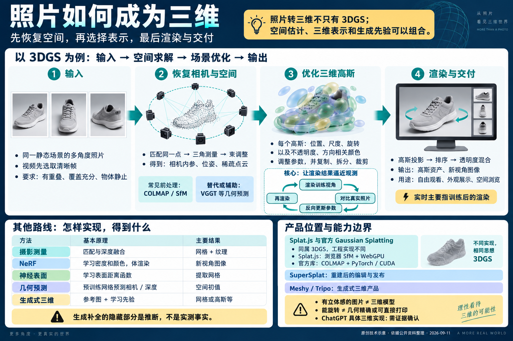

# 012 · Gaussian Splatting：照片如何成为三维

这是一个利用同一物体或场景的多角度照片，生成可自由切换视角、缩放浏览的三维效果的库，底层核心是 3DGS（三维高斯泼溅）算法。通常先用 COLMAP 求解相机位置和稀疏点云，再优化大量三维高斯，拟合照片中的形状与外观，最后实时渲染新视角。视频需要先抽取清晰帧；原生交付是高斯场景，不自动等于精确、可打印的网格模型。

其他照片到三维的技术路线还包括：摄影测量（SfM / MVS，恢复深度并生成网格与纹理）、NeRF（学习密度和颜色，通过体渲染合成新视角）、神经隐式表面（如 NeuS / VolSDF，学习表面函数后提取网格）。此外，DUSt3R / VGGT 等预训练几何模型可预测相机、深度或点图，作为重建初值；扩散／流模型等生成式三维方法可按参考图和学习先验生成资产。它们负责的环节不同，可以组合，并非互斥替代。

本地整理完整实现、21 个产品与框架、此前 Splat.js 实测，以及 ChatGPT 可能实现方式与公开证据边界。

[返回总索引](../../README.md) · [开始阅读](understanding.md) · [网页运行说明](app/README.md) · [来源与记录](notes.md)

## 项目信息

| 项目 | 内容 |
| --- | --- |
| 研究索引 / 历史目录 | 012 / 014-gaussian-splatting |
| 上游仓库 | [graphdeco-inria/gaussian-splatting](https://github.com/graphdeco-inria/gaussian-splatting) |
| 固定研究提交 | 54c035f7834b564019656c3e3fcc3646292f727d，提交日期 2024-10-30 |
| 资料核查日期 | 2026-09-11；产品页面按核查时公开内容整理 |
| 上游技术栈 | Python / PyTorch / CUDA / C++ / SIBR |
| 许可证 | Inria / MPII 专用研究与评估许可，商业使用需另行取得许可，详见 [上游原文](UPSTREAM-LICENSE.txt) |
| 研究状态 | 已完成本轮文档研究与网页整理；未运行官方库训练 |
| 网页状态 | 文档与网页已完成，统一 Pages 发布准备中；发布结果随后核验 |

## 结论先读

- 照片变三维不只有 3DGS。摄影测量、NeRF、高斯表示、隐式表面、预训练几何网络和生成式三维解决的环节不同，也能组合使用。
- 多张照片不是简单拼接。系统要建立像素对应关系，恢复相机和空间，再拟合几何或外观。
- 3DGS 用大量带位置、尺度、旋转、透明度和颜色的三维高斯拟合观测；投影与透明度混合生成新视角。
- 高质量浏览和精确几何资产应分别验收。3DGS 原生输出不等于适合制造、测量、骨骼动画的干净网格。
- 之前多图／视频重建实验属于 Splat.js；它与官方库共享 3DGS 大方向，但运行环境、相机求解和优化实现不同。XXD 微缩图片不是该实验。
- 不能仅凭 ChatGPT 里出现可旋转结果断言内部使用 3DGS，应核验输出、工具过程与官方公开说明。

## 完整阅读路径

| 章节 | 内容 |
| --- | --- |
| [从照片到三维](understanding.md) | 讨论结论、三层关系、此前鞋子实测与边界 |
| [六条技术路线](principles.md) | SfM / MVS、NeRF、3DGS、SDF、几何网络、生成式三维 |
| [3DGS 如何实现](implementation.md) | 参数、初始化、损失、增密、投影、混合、代码模块与硬件 |
| [21 个产品与框架](comparison.md) | 商业产品、开源计算工具、编辑器与生成式产品 |
| [ChatGPT 的已知与未知](chatgpt.md) | 公开能力证据、可能方案与判断方法 |
| [应用、扩展与验证](applications.md) | 适用场景、八个扩展方向、对照实验与指标 |
| [来源与研究记录](notes.md) | 固定版本、第一方参考资料、实际验证与待做实验 |



AI 生成的中文总览图，包含输入、相机求解、高斯训练、渲染输出与其他路线；非软件截图、重建结果或性能证明。[配图说明](assets/README.md)

## 本地网页

网页从本目录 Markdown 生成，文档与七个阅读页面共用内容。提供章节导航、页内目录、对照表和 Markdown 下载，无需模型密钥或第三方运行依赖。

在仓库根目录运行：

```powershell
node projects/014-gaussian-splatting/app/build.cjs
node projects/014-gaussian-splatting/app/check.cjs
python -m http.server 8774 --bind 127.0.0.1 --directory projects/014-gaussian-splatting/app/dist
```

访问 `http://127.0.0.1:8774/`。这是研究阅读网站，不提供在线上传照片、训练或三维生成。详见 [网页说明](app/README.md)。

## 本地新增与上游边界

本轮新增中文研究、原创 SVG、AI 总览图、静态阅读网站、来源登记和检查脚本。未修改或复制上游训练代码；保留上游许可证原文。历史 Splat.js 鞋子实验通过公开记录关联，未将其当作本库实测。后续复现训练应另记数据来源、配置、耗时和独立测试视角。