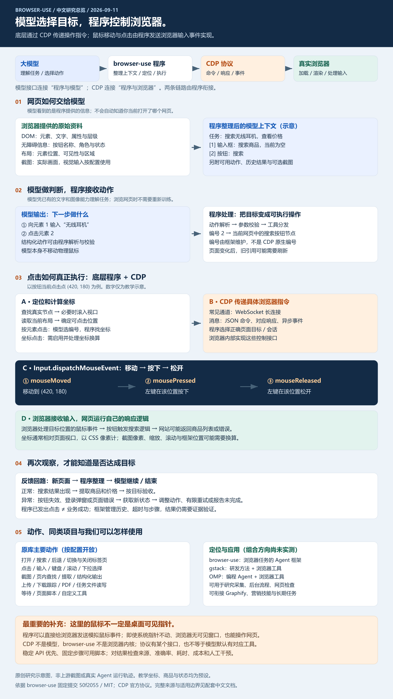

# 014 · Browser-use

Browser-use 是浏览器任务的 AI Agent 框架，支持网页导航、搜索、点击、输入、滚动、信息提取及多步流程。模型根据页面结构与可选截图选择目标；程序读取按钮当前布局、计算点击坐标，再通过底层 CDP 协议向真实浏览器发送鼠标移动、按下和松开事件，并读取结果继续执行。

CDP 是浏览器控制协议，本身不理解任务或计算按钮位置；定位与坐标计算由程序完成。这里的鼠标事件在浏览器内部处理，桌面系统指针不一定移动。

[返回总索引](../../README.md#项目索引) · [完整中文理解](understanding.md) · [研究与验证记录](notes.md) · [在线详细网页](https://yydshly.github.io/0911_codex_project/015-browser-use/) · [离线网页](app/dist/index.html) · [配图说明](assets/README.md)

## 项目信息

| 项目 | 内容 |
| --- | --- |
| 研究索引 | 014 |
| 历史目录 | 015-browser-use；按历史目录最大编号加一 |
| 用户话题序号 | 16；不作为仓库研究索引或目录编号 |
| 上游仓库 | [browser-use/browser-use](https://github.com/browser-use/browser-use) |
| 固定研究提交 | `50f205533fe10ba35b553d2a3689c77b87bd5d0a` |
| 研究日期 | 2026-09-11 |
| 上游技术 | Python、模型接口、CDP / cdp-use、真实浏览器 |
| 上游许可证 | MIT；[固定版本原文](https://github.com/browser-use/browser-use/blob/50f205533fe10ba35b553d2a3689c77b87bd5d0a/LICENSE) · [保存副本](sources/LICENSE.browser-use) |
| 研究状态 | 研究中：文档与源码已分析，上游 Agent 未实测 |
| 网页状态 | GitHub Pages 已部署并验证；[在线阅读](https://yydshly.github.io/0911_codex_project/015-browser-use/) |

## 原库能力与本地新增

**原库已有**：网页状态整理、模型决策循环、工具动作、浏览器会话、元素定位、CDP 输入与反馈、自定义工具。Python 库、关联 CLI 和云服务分开说明，不能把托管服务能力都算成开源库默认能力。

**本地新增**：12 节中文完整理解、一张全流程矢量图及 PNG、详细教学网页、正常搜索与旧按钮失效后的两个预设教学分支。文档、图和网页明确：系统鼠标指针不一定移动；模型判断与程序执行分开；发出点击后仍需检查业务结果。

网页不调用模型，不启动 CDP、不读取本机浏览器会话、不操作商品网站。教学动画并非上游原生运行轨迹。

## 完整理解图



原创研究示意图，非软件截图；坐标、商品和状态为教学预设。[打开可放大 SVG](assets/understanding-map.svg) · [高清 PNG](assets/understanding-map.png)。暂无上游实际运行截图。

## 阅读内容

- 浏览器、模型、程序和 CDP 的职责。
- 页面如何转换成模型可读的文字说明与可选截图。
- 模型接口与浏览器协议两条通信链路。
- 元素编号如何映射节点，以及滚动、坐标计算与鼠标输入细节。
- 浏览器内部事件与桌面系统鼠标指针的区别。
- 搜索示例、失败反馈、主要动作、gstack / OMP 比较。
- 使用场景、扩展方向、与 Graphify / 营销技能 / 长期任务的关系。
- 固定版本来源与未验证事项。

## 构建、验证与本地阅读

可直接打开 `app/dist/index.html`，不需要服务器或 API 密钥。生成器需要 Python 3.10+ 与 Markdown 3.10.2；静态检查需要 Node.js 22，依赖在本项目独立管理。

```powershell
python -m pip install -r projects/015-browser-use/app/requirements.txt
python projects/015-browser-use/app/build.py
node projects/015-browser-use/app/scripts/check.cjs
```

高清 PNG 由 SVG 渲染，生成方式见 [配图说明](assets/README.md)。修改图内容后需重新渲染 PNG，再构建以同步网页下载。

统一发布准备命令为 `node scripts/build-pages.cjs`。目录已合并到 [部署清单](../../docs/web-demos.json) 与 [工作流](../../.github/workflows/pages.yml)，已通过统一 Pages 发布。首次部署提交 `5a7febbc839a80a558ab4cb8ceb97ceb7aad9fd4` 的[发布工作流](https://github.com/yydshly/0911_codex_project/actions/runs/34510583092)成功；24 项线上核验通过，覆盖新站全部文件、总入口、预览图和既有子站入口。见[首次部署验证记录](deployment-verification.json)。

## 验证边界

静态检查验证引用、正文覆盖、下载产物、示意状态和编号；不验证上游 Agent 成功率。未安装上游运行环境，未调用模型或托管服务。可借鉴的组合方向仍待后续真实任务实验。
